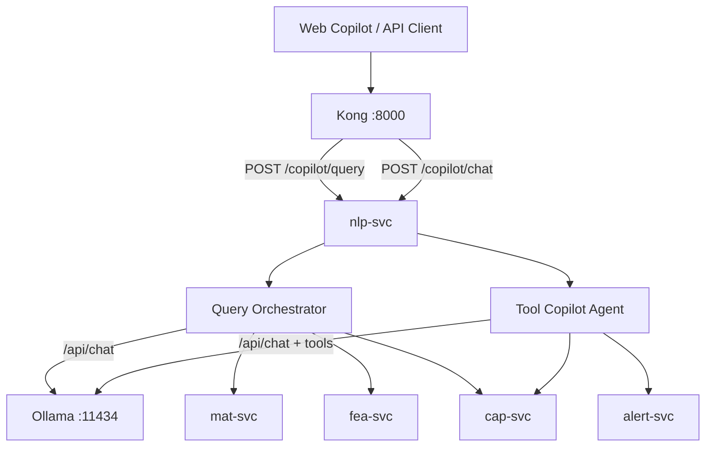

# IPE AI Agents — Verification, Roles, Usage & Ollama Deployment

**Version:** v7.0.0  
**Date:** 2026-06-27  
**Service:** `nlp-svc` (port 8007) via Kong `/api/v1/copilot/*`

---

## Executive Summary

| Agent | Status | LLM backbone | Ollama |
|-------|--------|--------------|--------|
| **Query Orchestrator** | ✅ Implemented | Ollama / OpenRouter / Anthropic | ✅ |
| **Intent Classifier** | ✅ Implemented | Same chain | ✅ |
| **Tool-Calling Copilot** | ✅ Implemented | Ollama tools + Anthropic | ✅ |
| **Structured Fallback** | ✅ Working | None (templates) | N/A |

**Ollama stack (container):** `docker compose ... -f docker-compose.ollama.yml --profile ollama up -d`  
**Ollama stack (host — recommended on Windows):** `docker compose ... -f docker-compose.ollama-host.yml up -d`  
**Start script:** `.\scripts\start-ollama-stack.ps1`  
**Primary provider:** `IPE_LLM_PRIMARY_PROVIDER=ollama` (auto prefers Ollama when URL set)

> **Kong timeout:** First Ollama responses can exceed Kong’s ~60s upstream limit. Use `http://localhost:8007` for direct nlp-svc testing, or increase Kong `read_timeout` for production Copilot routes.

---

## System Architecture (Ollama backbone)



---

## Agent 1: Query Orchestrator

### Verification (2026-06-27)

| Test | Input | Result | Latency |
|------|-------|--------|---------|
| Greeting | `"hi"` | `intent=general`, coherent reply | 1487 ms |
| Inventory | `"what finished goods in stock?"` | `intent=material_status`, 505 chars, Widget A data | 1412 ms |
| Ambiguous | `"unknown xyz nonsense query"` | `intent=general`, graceful reply | 1873 ms |
| Error path | LLM unavailable + keyword match | Falls back to structured formatter | — |

**Malfunction patterns observed:**

- Previously failed with 503 when no LLM configured and intent classification threw before fallback — **fixed** (intent catches `LLMUnavailableError`).
- OpenRouter 404 when model slug invalid — use `google/gemini-2.5-flash` or Ollama instead.
- Copilot UI shows generic offline message on any non-200 — check Kong + nlp-svc health first.

### Role Definition

**Primary purpose:** Answer planner questions by classifying intent, fetching live data from mat/cap/fea/dpe/res services, and synthesizing a concise natural-language response.

**Handles:**

- Material/inventory questions
- Demand and order status
- Capacity and utilization
- Delay and alert analysis
- Feasibility/at-risk MO queries
- Resolution scenario summaries
- General manufacturing guidance (with tenant context)

**Refuses / does not do:**

- Modify live MOs, schedules, or inventory
- Approve resolutions or schedules (human action in UI)
- Cross-tenant data access
- Execute ERP writes

**Communication style:** Data-driven, concise, cites structured context. Includes `intent` and `sources` in API response.

**Success metrics:**

| Metric | Target |
|--------|--------|
| HTTP 200 rate | >99% when nlp-svc + downstream healthy |
| P95 latency | <5s (cloud LLM), <15s (local Ollama 8B) |
| Intent accuracy | Keyword intents 100%; LLM intents >90% on test set |
| Data fidelity | Numeric answers match mat-svc/fea-svc source (±0) |

**Limitations:**

- 30-second timeout on `/copilot/query` path (orchestrator level)
- LLM may hallucinate if structured data empty — check `structured_data` in response
- Requires JWT + tenant context

### Usage Instructions

**Invoke:**

```http
POST /api/v1/copilot/query
Authorization: Bearer <JWT>
X-Tenant-ID: <tenant-uuid>
Content-Type: application/json

{"query": "what finished goods do we have?", "stream": false}
```

**UI:** Copilot page → type question → **Send** (`/copilot`)

**Input format:**

| Field | Type | Required | Notes |
|-------|------|----------|-------|
| `query` | string | Yes | Natural language, max ~2000 chars practical |
| `stream` | boolean | No | UI uses `false`; SSE path exists but unused in web UI |

**Output interpretation:**

```json
{
  "success": true,
  "data": {
    "intent": "material_status",
    "response": "The total finished goods inventory is...",
    "structured_data": { "items": [...] },
    "sources": ["nlp-svc:material_status", "system-context:material_status"]
  }
}
```

- **`intent`** — routing category; validate it matches your question
- **`response`** — LLM synthesis (or structured fallback text)
- **`structured_data`** — raw fetched data; use for audit/verification
- **`sources`** — provenance tags

**Common use cases:**

1. Morning inventory check: *"What FG stock do we have for Widget A?"*
2. Risk triage: *"Which MOs are at risk?"*
3. Capacity check: *"Which work centers are bottlenecks?"*
4. Delay post-mortem: *"What alerts are active?"*

**Troubleshooting:**

| Symptom | Fix |
|---------|-----|
| 503 `LLM_UNAVAILABLE` | Configure OpenRouter, Anthropic, or Ollama (see §Ollama) |
| Wrong intent | Rephrase with explicit keywords (stock, capacity, delay, feasibility) |
| Empty/generic answer | Check downstream service health (mat-svc, fea-svc) |
| 401/403 | Re-login; verify role (planner/admin/manager/supervisor/auditor) |

**Code location:** `services/nlp-svc/app/core/orchestrator.py` → `route_query()`

---

## Agent 2: Intent Classifier (Sub-Agent)

### Verification

- Keyword path: instant, no LLM (e.g., "stock" → `material_status`)
- LLM path: uses same `query_llm()` as orchestrator
- Fallback: returns `general` on LLM failure

### Role Definition

**Primary purpose:** Map user query to exactly one of seven intents before data fetching.

**Intents:** `demand_query`, `material_status`, `capacity_status`, `delay_analysis`, `feasibility_check`, `resolution_help`, `general`

**Handles:** Short classification prompt only — not user-facing directly.

**Refuses:** Multi-intent decomposition (picks one); ambiguous queries → `general`

**Success metrics:** Keyword hits <10ms; LLM classification <2s; no uncaught exceptions

**Limitations:** English-only keywords; LLM may misclassify vague queries

### Usage

Not invoked directly. Runs inside `route_query()`. To test indirectly, inspect `intent` field in `/copilot/query` response.

### Ollama model recommendation

| Hardware | Model | Why |
|----------|-------|-----|
| 8 GB RAM | `llama3.2:3b` | Fast single-token classification |
| 16 GB RAM | `llama3.1:8b` | Better disambiguation |
| GPU 8GB+ | `phi3:mini` | Very fast, good enough for labels |

Use the **same Ollama model** as orchestrator unless you split services later.

---

## Agent 3: Tool-Calling Copilot Agent

### Verification (2026-06-27)

```http
POST /api/v1/copilot/chat {"message": "what is MO-DEMO-001 status?", "stream": false}
→ success=true, response="LLM service not configured. Please set ANTHROPIC_API_KEY."
```

**Status:** ✅ Ollama tool-calling implemented in `ollama_tool_client.py` + `copilot_agent.py`. Uses Ollama when `IPE_LLM_PRIMARY_PROVIDER=ollama` or auto with Ollama URL set.

**When Anthropic is configured:** Tool loop runs up to 5 iterations; tools call cap-svc and alert-svc.

### Role Definition

**Primary purpose:** Multi-step reasoning with **tool calls** — order lookup, utilization, disruption simulation, war-room recovery.

**Tools available:**

| Tool | Action | Backend |
|------|--------|---------|
| `get_order_status` | MO schedule status | cap-svc |
| `get_resource_utilization` | Work center load % | cap-svc |
| `simulate_disruption` | Sandbox what-if (clone→inject→solve→diff) | cap-svc scenarios |
| `get_war_room_recovery` | Top 3 recovery options | alert-svc |

**Handles:**

- "What if machine X is down 8 hours?"
- "Status of MO-DEMO-001"
- "Utilization for Machining Center"

**Refuses (by design):**

- Direct live record modification (simulations use isolated scenario sandbox only)
- Deletes, approvals, ERP sync

**Communication style:** Step-by-step; may emit `tool_call` / `tool_result` events in streaming mode.

**Success metrics:**

| Metric | Target |
|--------|--------|
| Tool execution success | >95% when cap-svc healthy |
| Simulation completion | <30s for `simulate_disruption` |
| Max iterations | 5 (then asks user to rephrase) |

**Limitations:**

- **Requires Anthropic API** today (Claude tool-use format)
- Not used by default web UI (UI calls `/query`, not `/chat`)
- No Ollama/OpenRouter support without engineering work

### Usage Instructions

**Invoke:**

```http
POST /api/v1/copilot/chat
{"message": "Simulate 4 hour downtime on Machining Center", "stream": true}
```

**Streaming:** SSE events with types: `thinking`, `tool_call`, `tool_result`, `response`, `done`

**Non-streaming:** Aggregated `response` + `tool_calls` list in JSON.

**Troubleshooting:**

| Symptom | Fix |
|---------|-----|
| "LLM service not configured" | Set `IPE_ANTHROPIC_API_KEY` (sk-ant-...) |
| Tool errors in result | Check cap-svc / alert-svc health |
| Max iterations message | Simplify question or break into steps |
| Want local Ollama | Use `/copilot/query` instead, or implement Ollama tool-calling (see §Ollama) |

**Code location:** `services/nlp-svc/app/core/copilot_agent.py`

---

## Agent 4: Structured Fallback Formatter (Resilience Layer)

### Verification

When `LLM_ROUTING_ENABLED=false` and LLM fails, orchestrator returns formatted inventory/demand/capacity text from `structured_data` without LLM.

### Role Definition

**Primary purpose:** Guarantee usable answers when all LLM providers are down.

**Handles:** Template formatting for all seven intents from JSON payloads.

**Refuses:** Creative synthesis, cross-intent reasoning

**Success metrics:** Non-null formatted string when `structured_data` populated; numeric accuracy 100%

**Not an LLM agent** — deterministic Python templates in `response_formatter.py`.

### Usage

Automatic — no invocation needed. If you see bullet-list inventory without conversational prose, LLM likely failed and fallback activated.

---

## Agents 5–10: Testing AI Framework (Development Only)

Located in `testing/ai/agents/`. Invoked via:

```bash
python -m testing.ai.run [generate|regression|heal|visual|explore|optimize|all]
```

| Agent | Purpose | LLM | Ollama |
|-------|---------|-----|--------|
| Test Generation | Pytest cases from requirements | No | No |
| Regression | Prioritize test suites | No | No |
| Self-Healing | Diagnose test failures | No | No |
| Visual | UI route regression checklist | No | No |
| Exploratory | Risk-based test charters | No | No |
| Optimization | Reduce suite size | No | No |

**Verification:** Run `python -m testing.ai.run all --output testing/ai/results/`

**Role:** QA automation assistance — **not production runtime agents**. Human approval required before merging generated tests (per `AGENTS.md`).

---

# Ollama LLM Integration Guide

## What Works Today with Ollama

| Component | Ollama support |
|-----------|----------------|
| Query Orchestrator (`/copilot/query`) | ✅ via `LLMTierRouter._call_ollama` |
| Intent Classifier | ✅ same path |
| Tiered Router fallback | ✅ `_call_ollama` after cloud tiers fail |
| Tool-Calling Copilot (`/copilot/chat`) | ✅ Ollama + Anthropic |
| OpenRouter | ✅ separate path (current demo default) |

## Architecture (LLM routing)

```
User query
    │
    ▼
query_llm() ──► LLM_ROUTING_ENABLED?
    │                    │
    │ false              │ true
    ▼                    ▼
LLMTierRouter      TieredRouter
    │                    │
    ├─ OpenRouter (if key set)     ├─ Anthropic (SAAS tier)
    ├─ Anthropic                   ├─ SageMaker (PRIVATE_VPC)
    ├─ Ollama (if URL set)         ├─ vLLM (ON_PREM)
    └─ skip unconfigured           └─ Ollama fallback
```

---

## Step-by-Step: Deploy with Ollama Locally

### 1. Use full stack (not demo overlay)

Demo overlay **disables Ollama** (`profiles: ["full"]`). Start without demo overlay:

```powershell
cd E:\AISOP\ipe\infrastructure\docker
docker compose up -d db redis kafka zookeeper
docker compose up -d ollama
docker compose build nlp-svc
docker compose up -d nlp-svc kong dpe-svc mat-svc cap-svc fea-svc alert-svc
```

### 2. Pull a model into Ollama

```powershell
# Find container name
docker ps --filter ancestor=ollama/ollama

# Pull model (first time downloads ~4.7GB for 8B)
docker exec -it docker-ollama-1 ollama pull llama3.1:8b

# Verify
docker exec -it docker-ollama-1 ollama list
```

### 3. Configure nlp-svc environment

Create or edit `infrastructure/docker/.env`:

```env
# Pure local — disable cloud LLM
IPE_OPENROUTER_API_KEY=
IPE_ANTHROPIC_API_KEY=

# Ollama (Docker network hostname)
IPE_OLLAMA_ENDPOINT_URL=http://ollama:11434
IPE_OLLAMA_MODEL=llama3.1:8b

# Optional: enable tiered routing with Ollama fallback
IPE_LLM_ROUTING_ENABLED=false
```

Recreate nlp-svc:

```powershell
docker compose up -d --force-recreate nlp-svc
```

### 4. Verify Ollama from nlp-svc container

```powershell
docker exec docker-nlp-svc-1 sh -c 'wget -qO- http://ollama:11434/api/tags'
```

### 5. Test Query Orchestrator

```powershell
# Login, then:
Invoke-RestMethod -Method POST -Uri "http://localhost:8000/api/v1/copilot/query" `
  -Headers @{ Authorization="Bearer $token"; "X-Tenant-ID"="a0eebc99-9c0b-4ef8-bb6d-6bb9bd380a11"; "Content-Type"="application/json" } `
  -Body '{"query":"what finished goods in stock?","stream":false}'
```

**Admin UI check:** `/admin` → **LLM Tiers** tab → `ollama` should show **Available**.

---

## Model Recommendations by Agent Task

### Query Orchestrator + Intent Classifier (same model)

| Profile | Model | RAM | Latency | Quality |
|---------|-------|-----|---------|---------|
| **Minimum viable** | `llama3.2:3b` | 8 GB | 2–5s | Adequate for demos |
| **Recommended local** | `llama3.1:8b` | 16 GB | 5–12s | Good balance |
| **Quality-first** | `mistral:7b-instruct` | 16 GB | 5–10s | Strong instruction following |
| **GPU 24GB+** | `llama3.1:70b` | 48 GB+ | 30–60s | Best quality, too slow for UI |
| **CPU-only 16GB** | `phi3:mini` | 8 GB | 3–8s | Fast, weaker on complex JSON context |

**Do not use for Tool-Calling Copilot** without code changes — none of these expose Anthropic-style tool API.

### Tool-Calling Copilot (if staying on Anthropic)

| Use case | Model |
|----------|-------|
| Production tool agent | `claude-sonnet-4-20250514` (default in config) |
| Cost-sensitive | `claude-3-haiku-20240307` via Anthropic direct |

### Future: Ollama for Tool Agent

Implemented in IPE v7.0.0 via `OllamaToolClient` — requires Ollama 0.3+ with tool-capable model (`llama3.1:8b`, `qwen2.5:7b`).

---

## Performance Tuning (Local Hardware)

### Ollama environment variables (docker-compose override)

```yaml
nlp-svc:
  environment:
    IPE_OLLAMA_ENDPOINT_URL: http://ollama:11434
    IPE_OLLAMA_MODEL: llama3.1:8b

ollama:
  environment:
    OLLAMA_NUM_PARALLEL: "2"      # concurrent requests
    OLLAMA_MAX_LOADED_MODELS: "1"   # keep one model in RAM
  deploy:
    resources:
      reservations:
        devices:
          - driver: nvidia
            count: 1
            capabilities: [gpu]     # if NVIDIA GPU available
```

### nlp-svc tuning

| Setting | Default | Tuning |
|---------|---------|--------|
| `MODEL_CONFIG.max_tokens` | 1024 | Reduce to 512 for faster responses |
| Ollama timeout | 120s | Lower to 60s to fail fast |
| `_MAX_BUFFER_SIZE` (SSE chat) | 100 | N/A for query path |

### Hardware guide

| RAM | GPU | Recommended setup |
|-----|-----|-------------------|
| 8 GB | None | `phi3:mini` or `llama3.2:3b`; expect 5–15s |
| 16 GB | None | `llama3.1:8b` Q4 quantization |
| 16 GB | 8 GB VRAM | `llama3.1:8b` full GPU offload |
| 32 GB | 12+ GB VRAM | `mistral:7b` or `llama3.1:8b` + parallel=2 |

### Cold start

First request after model pull loads weights — expect 10–30s. Subsequent requests use cached model.

---

## Configuration Reference

| Env var | Purpose | Example |
|---------|---------|---------|
| `IPE_OLLAMA_ENDPOINT_URL` | Ollama base URL | `http://ollama:11434` |
| `IPE_OLLAMA_MODEL` | Model tag | `llama3.1:8b` |
| `IPE_OPENROUTER_API_KEY` | Cloud LLM (query agent) | `sk-or-v1-...` |
| `IPE_OPENROUTER_MODEL` | OpenRouter model slug | `google/gemini-2.5-flash` |
| `IPE_ANTHROPIC_API_KEY` | Tool-calling chat agent | `sk-ant-...` |
| `IPE_LLM_ROUTING_ENABLED` | Use TieredRouter | `false` (default demo) |
| `IPE_LLM_TIER_DEFAULT` | Tier 1/2/3 | `1` |

**Priority when multiple keys set:** OpenRouter prepended to fallback chain before Anthropic/Ollama in `LLMTierRouter`.

---

## Deployment Modes (Pick One)

### Mode A: Cloud LLM (current demo — works out of box)

```env
IPE_OPENROUTER_API_KEY=<your-key>
IPE_OPENROUTER_MODEL=google/gemini-2.5-flash
IPE_OLLAMA_ENDPOINT_URL=
```

- Query Orchestrator: ✅  
- Tool Chat: ❌ unless `IPE_ANTHROPIC_API_KEY` also set

### Mode B: Local Ollama only (air-gapped)

```env
IPE_OPENROUTER_API_KEY=
IPE_ANTHROPIC_API_KEY=
IPE_OLLAMA_ENDPOINT_URL=http://ollama:11434
IPE_OLLAMA_MODEL=llama3.1:8b
```

- Query Orchestrator: ✅  
- Tool Chat: ❌  
- Structured fallback: ✅ when Ollama down

### Mode C: Hybrid (recommended production local dev)

```env
IPE_OLLAMA_ENDPOINT_URL=http://ollama:11434
IPE_OLLAMA_MODEL=llama3.1:8b
IPE_ANTHROPIC_API_KEY=sk-ant-...   # only for /chat tool agent
```

- Query: Ollama first in chain if OpenRouter unset  
- Chat: Anthropic for tool use

---

## Known Gaps & Roadmap

| Gap | Impact | Workaround |
|-----|--------|------------|
| `/chat` requires Anthropic | Tool simulations unavailable locally | Use `/query` + Resolution Center UI |
| Demo overlay disables Ollama | Ollama not started | Use full `docker-compose.yml` |
| UI uses `/query` only | Users never hit tool agent | API integrators can use `/chat` |
| No Ollama tool-calling | Local what-if via Copilot chat | Use Schedule scenario sandbox in UI |
| Intent LLM on every non-keyword query | Extra latency | Keywords cover common queries |

---

## Quick Verification Checklist

```powershell
# 1. nlp-svc health
Invoke-WebRequest http://localhost:8007/api/v1/health

# 2. Ollama health (if deployed)
Invoke-WebRequest http://localhost:11434/api/tags

# 3. Query agent
# POST /api/v1/copilot/query with JWT → success=true, intent set

# 4. Chat agent (needs Anthropic)
# POST /api/v1/copilot/chat → should NOT say "not configured"

# 5. LLM status (admin login)
# GET /api/v1/copilot/llm-status → active_provider set

# 6. Demo regression
cd E:\AISOP\ipe
.\scripts\run-full-demo.ps1   # checkpoints 10-11 cover Copilot
```

---

*Document reflects IPE v7.0.0 codebase and live verification on 2026-06-27.*
