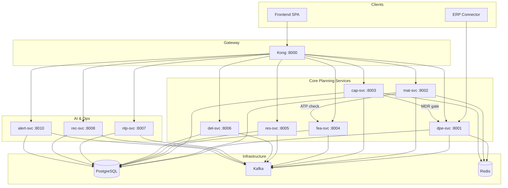
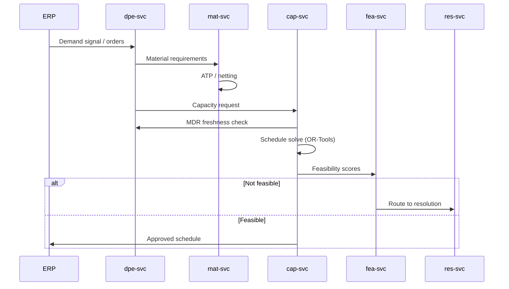

# IPE Architecture

Consolidated architecture reference for v7.0.0. Detailed sub-documents remain in `docs/architecture/`.

---

## Service Dependency Graph

---

## Order → Plan → Schedule → Execute Loop

---

## Port Map

| Component | Port | Notes |
|-----------|------|-------|
| Kong (API gateway) | 8000 | Public entry |
| dpe-svc | 8001 | Auth, demand, MDR, CTP |
| mat-svc | 8002 | Material, ATP |
| cap-svc | 8003 | Capacity, schedule, CPM |
| fea-svc | 8004 | Feasibility gates |
| res-svc | 8005 | Resolution center |
| del-svc | 8006 | Delay, quality |
| nlp-svc | 8007 | Copilot |
| rec-svc | 8008 | Reconciliation |
| connector | 8009 | ERP adapter |
| alert-svc | 8010 | Alerts, war room |
| Frontend | 3000 | React SPA |
| Prometheus | 9090 | Metrics |
| Grafana | 3001 | Dashboards (monitoring overlay) |
| Loki | 3100 | Log aggregation |

Demo overlay may remap ports; see `docker-compose.demo.yml`.

---

## Kafka Topic Inventory

| Topic | Producers | Consumers | Purpose |
|-------|-----------|-----------|---------|
| `ipe.demand.classified` | dpe-svc | mat-svc, fea-svc | Classified demand events |
| `ipe.material.atp` | mat-svc | cap-svc | ATP availability updates |
| `ipe.schedule.approved` | cap-svc | connector, alert-svc | Approved MO schedule |
| `ipe.feasibility.scored` | fea-svc | res-svc, nlp-svc | Gate scores |
| `ipe.chaos.event` | alert-svc | nlp-svc, cap-svc | Chaos / war room events |
| `ipe.audit.log` | all services | — | Audit trail |

See `docs/architecture/event-mesh.md` for schemas.

---

## Data Model

PostgreSQL CDM with tenant RLS. See `docs/architecture/data-model.md`.

---

## Authentication

- **v7.0.0:** JWT via `dpe-svc` + Kong JWT plugin
- **v8.0.0 (planned):** Keycloak OIDC/SAML — see `docs/decisions/ADR-001-keycloak-deferral.md`

---

## Related Documents

- [System Overview](architecture/system-overview.md)
- [Data Model](architecture/data-model.md)
- [Event Mesh](architecture/event-mesh.md)
- [Deployment](deployment.md)
- [API Reference](api-reference.md)
