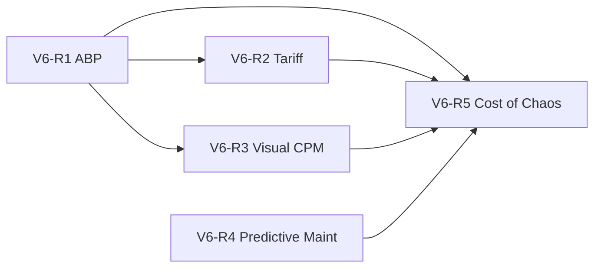

# Implementation Plan: IPE V6.0 — AI-First Strategic Reassessment

**Branch**: `004-ai-first-v6` | **Date**: 2026-06-23 | **Spec**: [spec.md](./spec.md)

**Input**: ENP & IPE V6.0 Unified Master Blueprint (June 2026), building on **`003-autonomous-planning-v5`** @ v1.0.0 (`4efb8de`)

**User goal**: Evolve IPE from a **feasible scheduler** to a **Financially-Aware, Attribute-Driven Resilience Engine** — margin/cost-aware planning, tariff resilience, Visual CPM, predictive maintenance, and Cost of Chaos translation.

---

## Summary

**Technical approach**: Five phased modules (V6-R1–R6-R5) over ~18 weeks on the existing IPE monorepo. Each phase extends services already delivered in v1.0.0 — no greenfield rewrite. Phoenix (Engine A) remains out of scope.

**Baseline readiness**: **92/100** (post-003 v1.0.0 — see [../003-autonomous-planning-v5/clarify.md](../003-autonomous-planning-v5/clarify.md))  
**Target after V6-R1**: **93/100** (ABP + guardrail)  
**Target after V6-R2**: **94/100** (tariff / landed cost)  
**Target after V6-R3**: **95/100** (Visual CPM)  
**Target after V6-R4**: **95.5/100** (predictive maint pilot)  
**Target after V6-R5**: **96/100** achieved — tag **v6.0.0** pending T055

**Status**: **V6-R1–R5 executed** (54/55) — see [converge-v6.md](./converge-v6.md), [analyze-v6.md](./analyze-v6.md). **Release track active** — see [Appendix: Release Verification](#appendix-release-verification-rv) and [../005-ipe-program-status/plan.md](../005-ipe-program-status/plan.md).

---

## Technical Context

**Language/Version**: Python 3.12+ (14+ microservices), TypeScript 5.5 / React 18

**Primary Dependencies**: FastAPI, SQLAlchemy async, PostgreSQL 16, Kafka/Avro, OR-Tools CP-SAT, openpyxl, existing `financial_projection` + `scheduler_cost`

**Storage**: PostgreSQL CDM + RLS; migrations **024–027** for V6 entities

**Testing**: pytest (dpe/mat/cap/fea/connector), Vitest (Gantt CPM), Playwright timing for SC-V6-03

**Target Platform**: Docker Compose (dev); reuse 003 K8s/Helm for staging

**Performance Goals**:

| SLO | Target |
|-----|--------|
| Visual CPM cascade | p95 **<2s** (≤20 MOs) |
| Tariff shock recompute | **<5s** open MO portfolio |
| Maintenance block → reschedule | **≤60s** e2e |
| Activity-based schedule solve | ≤30s (unchanged from 003) |

**Constraints**: Constitution I–VI; extend 003 approve/outbox — do not fork persistence model

**Scale/Scope**: 18 FRs + 3 cross-cutting; **55 implementation tasks** (T001–T055) + **17 release tasks** ([tasks-release.md](./tasks-release.md))

---

## Constitution Check

| Principle | Feature Impact | Phase |
|-----------|----------------|-------|
| **I. Tenant RLS** | Migrations 024–027 enable RLS on all new tables | V6-R1–R4 |
| **II. Auth/RBAC** | CFO read on Cost of Chaos; planner on CPM drag/promote; admin on tariff matrix | All |
| **III. Test-backed** | Every task includes pytest/Vitest | All |
| **IV. Event mesh** | `ipe.tariff.shock`, `ipe.maintenance.block_required`, `ipe.chaos.metric` Avro + consumers | V6-R2, R4, R5 |
| **VI. Observability** | New endpoints in `/metrics`; CPM latency histogram | V6-R3+ |

---

## Architecture Decisions

### AD-007: Visual CPM lives in cap-svc first (not new microservice)

**Decision**: Implement `cap-svc/app/core/visual_cpm.py` + `POST /capacity/cpm/cascade` before any `visual-cpm-svc` split.

**Rationale**: Reuses work-order graph, solver constraints, and schedule persistence from 003; meets <2s SLO on demo scale without new deployable.

### AD-008: Net-margin priority in dpe-svc, consumed by cap-svc

**Decision**: Extend `dpe-svc/app/core/priority.py` with `compute_margin_adjusted_priority()` using `financial_projection.generate_financial_projection()` + `cdm_activity_cost_drivers`. `cap-svc/priority_resolver.py` calls new `GET /demand/priority/margin-aware` or inline shared helper.

**Rationale**: Priority is demand-domain; keeps CP-SAT wiring in cap-svc unchanged except weight source.

### AD-009: Total Landed Cost in mat-svc pATP path

**Decision**: Extend `mat-svc/app/core/atp.py` (probabilistic ATP) to join `cdm_material_attributes` + `cdm_landed_cost_profiles`; return `landed_cost_per_unit`, `tariff_component`, `freight_component`.

**Rationale**: Material feasibility domain; fea-svc consumes enriched material scores unchanged.

### AD-010: Tariff shock orchestration in dpe-svc + mat-svc

**Decision**: `dpe-svc` exposes `POST /demand/tariff/shock` (scenario params → impacted MO list + margin erosion). `mat-svc` recalculates landed cost. Substitute drafts enqueue via connector `sync_bom_substitution` action (approve required).

**Rationale**: Separates scenario orchestration from inventory math.

### AD-011: FR-I-06 guardrail at 85% on ERP write paths

**Decision**: Enforce in `connector` before Odoo POST and in `cap-svc` `approve_schedule_mos` when `feasibility_score < 85`; emit audit + downgrade autonomy flag to `suggest`.

**Rationale**: Aligns V6.0 FR-I-06 with existing `fea-svc` auto-confirm at 90+ — harmonize to **85% block / 90% auto** documented in clarify.

### AD-012: Cost of Chaos aggregates audit + delay + override streams

**Decision**: `dpe-svc/app/core/chaos_cost.py` rolls up: `cdm_audit_log` (manual overrides), `del-svc` delay categories, `cap-svc` maintenance blocks, activity cost rates → Pareto categories ($).

**Rationale**: No new event store; CFO dashboard reads materialized daily snapshot + real-time tail.

### AD-013: IoT RUL via Kafka → cap-svc maintenance calendar

**Decision**: `quality-svc` or `cap-svc/iot` publishes `ipe.maintenance.block_required`; cap-svc injects `MaintenanceWindow` into solver input and triggers partial re-solve.

**Rationale**: Extends existing `iot_health.py` from reactive degrade to proactive 48h block.

---

## Project Structure

```text
specs/004-ai-first-v6/
├── spec.md
├── plan.md                 # This file
├── tasks.md
├── quickstart.md
├── clarify-v6.md           # Binding decisions (/speckit.clarify)
├── tasks-release.md        # RV + doc sync tasks
├── analyze-v6.md           # Cross-artifact analysis
├── contracts/
│   ├── v6-r1-abp.md
│   ├── v6-r2-tariff.md
│   ├── v6-r3-visual-cpm.md
│   ├── v6-r4-predictive-maint.md
│   └── v6-r5-chaos-warroom.md
└── checklists/requirements.md

ipe/
├── migrations/versions/
│   ├── 024_add_activity_cost_drivers.py
│   ├── 025_add_material_attributes_landed_cost.py
│   ├── 026_add_machine_health_telemetry.py
│   └── 027_add_chaos_cost_snapshots.py
├── services/
│   ├── dpe-svc/app/core/
│   │   ├── margin_priority.py          # NEW V6-R1
│   │   ├── tariff_shock.py             # NEW V6-R2
│   │   └── chaos_cost.py               # NEW V6-R5
│   ├── mat-svc/app/core/
│   │   └── landed_cost.py              # NEW V6-R2
│   ├── cap-svc/app/core/
│   │   ├── activity_objective.py       # NEW V6-R1 (extends scheduler_cost)
│   │   └── visual_cpm.py               # NEW V6-R3
│   ├── fea-svc/ + connector/           # FR-I-06 guardrail V6-R1
│   └── shared/ipe_shared/events/schemas/
│       ├── ipe_tariff_shock.avsc
│       ├── ipe_maintenance_block_required.avsc
│       └── ipe_chaos_metric.avsc
└── apps/web/src/features/
    ├── schedule/                       # Drag-drop CPM Gantt V6-R3
    ├── tariff/                         # Tariff shock dashboard V6-R2
    ├── cost-of-chaos/                  # CFO dashboard V6-R5
    └── war-room/                       # Ranked recovery V6-R5
```

---

## Phase Overview

| Phase | Duration | Focus | Exit Gate | Key Services |
|-------|----------|-------|-----------|--------------|
| **V6-R1** | Wks 1–4 | ABP + activity objective + FR-I-06 | ≥8% cost delta demo | dpe-svc, cap-svc, fea-svc, connector |
| **V6-R2** | Wks 5–8 | Attributes, landed cost, tariff shock | Substitute draft + pATP TLC | mat-svc, dpe-svc, connector, web |
| **V6-R3** | Wks 9–11 | Visual CPM drag-drop | p95 cascade <2s | cap-svc, web |
| **V6-R4** | Wks 12–14 | Predictive maint + MDR auto-correction | Telemetry → block → routing draft | cap-svc, quality-svc, connector |
| **V6-R5** | Wks 15–18 | Cost of Chaos + generative War Room | CFO dashboard + top-3 recovery | dpe-svc, alert-svc, res-svc, nlp-svc, web |

---

## Phase V6-R1: Activity-Based Planning (Weeks 1–4)

### V6-R1.1 Database (Days 1–2)

- Migration **024**: `cdm_activity_cost_drivers` (tenant_id, product_id, setup_mins, overtime_rate, expedite_cost_per_unit, overhead_pct) + RLS
- Seed demo activity drivers for Widget A / Gadget B MOs

### V6-R1.2 Margin Priority (Days 2–5)

| Module | Responsibility |
|--------|----------------|
| `margin_priority.py` | Net margin = revenue − COGM − activity overhead; merge with existing `priority_score` |
| `dpe-svc/api/v1/demand.py` | `GET /demand/priority/margin-aware` |
| `priority_resolver.py` | Prefer margin-adjusted weight when drivers present |

### V6-R1.3 Activity-Based Solver Objective (Days 4–8)

| Module | Responsibility |
|--------|----------------|
| `activity_objective.py` | Extend CP-SAT objective: tardiness×priority + α×overtime + β×setup_changes + γ×expedite |
| `capacity.py` | Strategy preset `margin_throughput`; expose `activity_cost_breakdown` in response |
| `heuristic_scheduler.py` | Include `activity_cost_estimate`, `optimality_gap` flag |

**New / extended API**:

| Method | Path | Purpose |
|--------|------|---------|
| GET | `/demand/priority/margin-aware` | Margin-adjusted MO weights |
| POST | `/capacity/schedule` | `strategy=activity_optimized` param |

### V6-R1.4 FR-I-06 Guardrail (Days 6–8)

- Block `approve_schedule_mos` + connector Odoo sync when `feasibility_score < 85`
- Audit event `autonomy_downgraded_to_suggest`

### V6-R1.5 Tests & Demo (Days 8–10)

- `test_margin_priority.py`, `test_activity_objective.py`, `test_guardrail_85.py`
- Demo checkpoint **17**: margin-aware schedule ordering

---

## Phase V6-R2: Attribute-Based Planning & Tariff (Weeks 5–8)

### V6-R2.1 Database (Days 1–2)

- Migration **025**: `cdm_material_attributes`, `cdm_landed_cost_profiles` + RLS
- Demo seed: Region X/Y origins, tariff codes

### V6-R2.2 Landed Cost in pATP (Days 2–6)

- `landed_cost.py`: TLC = base + freight + tariff + risk_premium
- Extend `POST /material/probabilistic-atp` response schema

### V6-R2.3 Tariff Shock Simulator (Days 5–10)

| API | Purpose |
|-----|---------|
| `POST /demand/tariff/shock` | Apply region + % → impacted MOs, margin erosion |
| `GET /demand/tariff/exposure` | Heatmap data for UI |
| `POST /demand/tariff/substitute-draft` | Enqueue connector BOM substitution |

- Frontend: `TariffShockPage.tsx` or panel on Control Tower
- Excel import: extend project plan parser pattern for tariff matrix sheet

### V6-R2.4 Events & Tests

- Avro `ipe.tariff.shock`; connector consumer `handle_tariff_shock`
- Demo checkpoint **18**: +25% Region X → MO list + substitute draft

---

## Phase V6-R3: Visual CPM (Weeks 9–11)

### V6-R3.1 CPM Engine (Days 1–5)

- `visual_cpm.py`: dependency graph, critical path (longest path), slack calculation
- `POST /capacity/cpm/cascade`: input `{mo_id, delta_minutes}` → updated ops, critical_path_ids, financial_delta, conflicts

### V6-R3.2 Frontend (Days 5–10)

- Extend `GanttChart.tsx`: drag handle, dependency arrows, critical path CSS (red)
- `SchedulePage` / Resolution: confirm drag → existing approve flow (proposal only until approve)
- Playwright perf test: cascade p95 <2s

### V6-R3.3 Tests & Demo

- `test_visual_cpm.py`, `test_api_cpm_cascade.py`
- Demo checkpoint **19**: drag MO + critical path refresh

---

## Phase V6-R4: Predictive Maintenance & MDR Auto-Correction (Weeks 12–14)

### V6-R4.1 Database & Ingest (Days 1–3)

- Migration **026**: `cdm_machine_health_telemetry` + RLS
- `POST /iot/telemetry` or extend `cap-svc/iot` with RUL hours

### V6-R4.2 Maintenance Blocks (Days 3–7)

- Publish `ipe.maintenance.block_required` when RUL <48h
- cap-svc: inject calendar block, partial re-solve affected MOs
- fea-svc: surface capacity constraint in queue

### V6-R4.3 MDR Auto-Correction Draft (Days 7–10)

- `dpe-svc` or `rec-svc`: detect routing deviation >15%
- Connector action `sync_routing_correction` with before/after standard times
- Demo checkpoint **20**: CNC-04 RUL event → reschedule

---

## Phase V6-R5: Cost of Chaos & Generative War Room (Weeks 15–18)

### V6-R5.1 Cost of Chaos (Days 1–7)

- Migration **027**: `cdm_chaos_cost_snapshot` (daily rollup) + RLS
- `chaos_cost.py` + `GET /analytics/cost-of-chaos`
- Frontend: `CostOfChaosPage.tsx` at `/cost-of-chaos`; CFO RBAC read-only

### V6-R5.2 Generative War Room (Days 5–12)

- Extend `alert-svc/war_room.py`: `GET /war-room/recovery-plan` → top 3 from res-svc ranked by business_score ($)
- War Room UI: recovery cards with activity cost + delivery impact
- nlp-svc: war-room intent cites scenario IDs (when LLM routing enabled)

### V6-R5.3 Excel Export & Release (Days 10–14)

- Export Gantt → MS Project XML (minimal writer)
- Extend `run-full-demo.ps1` checkpoints 17–20
- Update `READINESS.md` to ≥96/100; tag **v6.0.0**

---

## Risk Register

| Risk | Mitigation |
|------|------------|
| CPM <2s misses on large plants | Demo scope ≤20 MOs; async cascade for >50 MOs (post-v6.0.0) |
| Missing GL/overhead data | Seed drivers; Warning fallback per V6-1 acceptance |
| Tariff matrix stale | Excel import + Admin CRUD; no live API required MVP |
| IoT adapter diversity | Synthetic telemetry for demo; document MQTT adapter backlog |
| Scope creep Phoenix | Explicit out-of-scope in spec + plan |

---

## Dependency Graph



V6-R2 can start after R1 margin API; V6-R3 requires R1 activity cost metadata on cascade response; V6-R5 consumes all prior phases.

---

---

## Appendix: Release Verification (RV)

**Prerequisite**: T001–T054 complete. **Binding gates**: [clarify-v6.md](./clarify-v6.md) C-V6-09.

| Phase | Goal | Exit gate | Tasks |
|-------|------|-----------|-------|
| **RV-01** | Stack up + seed | API :8000, migrations 027 | RV-01–04 in [tasks-release.md](./tasks-release.md) |
| **RV-02** | Backend tests | launch-verify **10/10** | RV-05–07 |
| **RV-03** | Live demo | run-full-demo **20/20** | RV-08–10 |
| **RV-04** | Tag v6.0.0 | T055 + stakeholder approval | RV-11–14 |
| **RV-05** | Production 100/100 | k6 + Chaos evidence | RV-15–17 (optional) |

### RV-01 — Stack (2–4h)

1. `cd ipe/infrastructure/docker && docker compose up -d`
2. Verify health; run `scripts/seed-demo-client.ps1`
3. Confirm migrations 024–027 applied

### RV-02 — launch-verify (1–2h)

```powershell
cd D:\AISOP\ipe
.\scripts\launch-verify.ps1
```

Save output to `specs/004-ai-first-v6/evidence/rv-02-launch-verify.txt`.

### RV-03 — Demo (1–2h)

```powershell
.\scripts\run-full-demo.ps1 -ReportPath docs\demo-run-report-v6.txt
```

Validates SC-V6-01–06 live (checkpoints 17–20).

### RV-04 — Tag T055 (30m)

After RV-01–03 green + approval: `git tag -a v6.0.0`.

### RV-05 — 100/100 (3–5 days)

`run-k6-200vu.ps1` + `r4-verify.ps1`; update READINESS.md.

---

## Appendix: Post-v6.0.0 Roadmap

See [../005-ipe-program-status/plan.md](../005-ipe-program-status/plan.md) Phase POST for:

- **POST-A**: Async CPM, visual-cpm-svc split, real-time Chaos UI
- **POST-B**: Keycloak, SAP/D365, production routing correction
- **POST-C**: schedule_version table, Twin promote, legacy RLS
- **POST-D**: Stripe, mobile, WCAG, Phoenix (out of scope unless requested)

---

**Next**: Execute [tasks-release.md](./tasks-release.md) starting RV-01, or run `/speckit.implement`.
