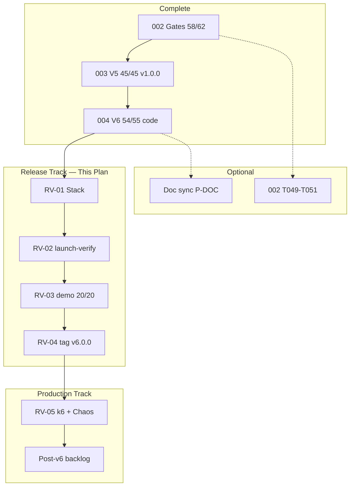

# Implementation Plan: IPE Program — Release & Post-V6 Roadmap

**Feature**: `005-ipe-program-status` | **Date**: 2026-06-26  
**Spec**: [spec.md](./spec.md) | **Clarify**: [clarify.md](./clarify.md) | **Analyze**: [analyze.md](./analyze.md) | **Converge**: [converge.md](./converge.md)  
**Quickstart**: [quickstart.md](./quickstart.md)

---

## Summary

IPE program delivery is **97% complete** (157/162 speckit tasks + demo fixes T016–T026). V6 product code is **55/55** done; live demo is **20/20** stable. Release path: **v6.0.0 tagged** → **REL-PROD** (k6, Chaos, coverage, ops) → **v6.1.0**.

| Milestone | Readiness | Trigger |
|-----------|-----------|---------|
| **v6.0.0 tag** | 97/100 | ✅ T022 20/20 + T023 git + T024 approval |
| **v6.0.1** | 97/100 | Audit fixes live-verified post-rebuild |
| **Production claim** | 100/100 | REL-PROD: k6 + Chaos + coverage 60% + ops |
| **Enterprise IdP** | +security | Keycloak sandbox (BLOCKED C-007) |

**Estimated effort to 100/100**: **~4 days** (REL-PROD Wave 2)

---

## Phase 0–2 Status (COMPLETE)

| Phase | Status | Evidence |
|-------|--------|----------|
| 0 — Git foundation | ✅ | 5 commits; tags v1.0.0, v6.0.0 |
| 1 — Demo 20/20 + tag | ✅ | `docs/demo-run-report-v6.txt` |
| 2 — Audit code fixes | ✅ | `fea0705` C-01, BUG-02, BUG-03 |
| 2 — Audit remainder | ⬜ | C-03, C-04, SEC-05 |

---

## Current Critical Path → Phase 3 REL-PROD

§15 execution order (git init → demo fixes → tag) is **COMPLETE**. Active work:

1. Rebuild cap-svc/mat-svc; verify 20/20 post-audit fixes
2. k6 smoke + 10 VU + 200 VU baselines
3. Chaos scenarios C1–C6
4. Coverage 40% → 60%
5. Loki + Grafana MVP
6. Tag **v6.1.0** after evidence package

---

## Phase 0: Git Foundation (binding — Master Plan §5)

| Step | Action | Verification |
|------|--------|--------------|
| 0.1 | `git init` + initial commit (T023) | `git log -1` |
| 0.2 | Optional `v1.0.0` baseline tag on pre-fix snapshot | N/A if first commit includes all fixes |
| 0.3–0.6 | Audit fixes C-01, C-02, BUG-02, BUG-03 (T025–T026) | Post-tag |
| 0.7 | `git tag v6.0.0` after T022 20/20 (T024) | User approval required |

---

## Summary (original scope)

---

## Tech Stack (Chosen — IPE Monorepo)

| Layer | Technology | Version / Notes |
|-------|------------|-----------------|
| **Backend** | Python, FastAPI | 3.12+ |
| **ORM / DB** | SQLAlchemy async, PostgreSQL | PG 16, Alembic migrations 001–027 |
| **Multi-tenant** | Row-Level Security | `app.current_tenant` per Constitution I |
| **Events** | Kafka + Avro Schema Registry | tariff.shock, maintenance.block_required |
| **Solver** | OR-Tools CP-SAT | cap-svc `visual_cpm.py`, `activity_objective.py` |
| **Frontend** | React 18, TypeScript 5.5, Vite | Routes: `/schedule`, `/tariff`, `/cost-of-chaos` |
| **Auth (demo)** | JWT | Keycloak deferred (C-007 BLOCKED) |
| **Observability** | Prometheus, OpenTelemetry, JSON logs | CPM latency histogram on cap-svc |
| **Infra (dev)** | Docker Compose | Kong :8000, web :8082, ~28 containers |
| **Infra (staging)** | K8s / Helm (003 baseline) | Reuse existing charts |
| **Testing** | pytest, Vitest, Playwright | `launch-verify.ps1`, `run-full-demo.ps1` |
| **Load / chaos** | k6, Chaos Mesh scripts | RV-05 for 100/100 |
| **ERP (demo)** | Mock Odoo connector | HMAC outbox; no live SAP/D365 |

**V6 service map**:

| Module | Primary services |
|--------|------------------|
| V6-R1 ABP | dpe-svc, cap-svc, fea-svc, connector |
| V6-R2 Tariff | mat-svc, dpe-svc, connector, web |
| V6-R3 CPM | cap-svc, web |
| V6-R4 Maint | cap-svc/iot, connector |
| V6-R5 Chaos | dpe-svc, alert-svc, nlp-svc, web |

---

## Program Architecture (Current State)



---

## Constitution Check (Release Phases)

| Principle | Release impact |
|-----------|----------------|
| **I RLS** | No new migrations in RV phases — verify migrations 024–027 applied on demo DB |
| **II Auth** | Demo JWT only; Keycloak remains waived (C-V6-02) |
| **III Tests** | RV-02 MUST pass 10/10; fixes only if regressions found |
| **IV Events** | Smoke: tariff + maintenance consumers healthy in compose stack |
| **V API** | RV-03 validates frontend-backend contract live |
| **VI Observability** | `/metrics` + CPM histogram reachable after stack up |

---

## Phase P-DOC — Documentation Sync (4h)

**Goal**: Eliminate cross-artifact drift (analyze X-02–X-09).

| Task ID | Deliverable | Files | Priority |
|---------|-------------|-------|----------|
| P-DOC-01 | Fix 004 status header | `005/spec.md` L139, mermaid L180 | P1 |
| P-DOC-02 | Refresh V6-R2–R5 tracker tables | `004/implementation-tracker.md` | P1 |
| P-DOC-03 | Mark SC-V6 proven after RV-03 | `implementation-tracker.md`, `analyze-v6.md` | P1 |
| P-DOC-04 | Notion table → synced | `005/spec.md` Notion section | P2 |
| P-DOC-05 | Demo CP numbering note | `004/quickstart.md`, `003/clarify.md` cross-ref | P2 |
| P-DOC-06 | SPECKIT checklist V6 footnote | `SPECKIT-CHECKLIST.md` | P2 |
| P-DOC-07 | plan.md task count 55 | `004/plan.md` | P2 |
| P-DOC-08 | Readiness history labels | `005/spec.md` readiness table | P1 |

**Exit gate**: Zero HIGH inconsistencies in analyze matrix.

---

## Phase RV-01 — Stack & Infrastructure (2–4h)

**Goal**: Reproducible live environment for demo and verification.

**Primary path**: Lean demo overlay via `rel-demo-stack.ps1` (see [quickstart.md](./quickstart.md) Path A).

### Prerequisites

- Docker Desktop running (≥8 GB RAM)
- `E:\AISOP\ipe\.env` from `.env.template`
- Ports 8000 (API), 8082 (web), 5432, 6380, 9092 free
- **Scope**: IPE stack only — ignore unrelated containers on host

### Steps (lean path — recommended)

| Step | Action | Verification |
|------|--------|--------------|
| 1 | `cd E:\AISOP\ipe` | — |
| 2 | `.\scripts\rel-demo-stack.ps1` | Infra → build → migrate → services → seed → demo |
| 3 | Or `-SkipBuild` if images exist | Faster retry |
| 4 | `curl http://localhost:8000/health` | 200 |
| 5 | Alembic head on demo DB | Migration **027** |
| 6 | Demo report | `docs/demo-run-report-v6.txt` |

Compose files: `docker-compose.yml` + **`docker-compose.demo.yml`** (no Ollama/Airflow/Keycloak gate).

### Steps (full path — optional)

| Step | Action | Verification |
|------|--------|--------------|
| 1 | `cd E:\AISOP\ipe\infrastructure\docker` | — |
| 2 | `docker compose config` | exit 0 |
| 3 | `docker compose up -d` | All healthchecks green (may pull Ollama ~500MB) |
| 4 | `..\..\scripts\seed-demo-client.ps1` | V6 seed data |

### Troubleshooting

| Symptom | Fix |
|---------|-----|
| Ollama pull timeout | Use demo overlay (Path A) |
| V6 routes 404 | Rebuild app images; confirm Kong up |
| CP4/15 timeout | Rebuild cap-svc; demo uses 3 MOs |
| Docker daemon hang | Restart Docker Desktop |
| Build context slow | First run 10–20 min; use `-SkipBuild` on retry |

**Exit gate**: API + Kong healthy; seed complete; ready for RV-02/03.

---

## Phase RV-02 — Backend Verification (1–2h)

**Goal**: `launch-verify.ps1` — **10/10** services pass.

### Command

```powershell
cd E:\AISOP\ipe
.\scripts\launch-verify.ps1
```

### Service matrix

| Service | V6 relevance |
|---------|--------------|
| shared | JWT, RLS helpers |
| cap-svc | CPM, maintenance, schedule |
| dpe-svc | margin, tariff, chaos_cost |
| mat-svc | landed_cost |
| fea-svc | guardrail integration |
| connector | tariff + routing handlers |
| nlp-svc | 4 copilot tools incl. war room |
| res-svc | War Room scenarios |
| del-svc | delay → chaos rollup |
| alert-svc | recovery-plan API |

### Known fix area

- **nlp-svc**: `test_copilot_tools.py` expects 4 tools — verify `get_war_room_recovery` registered

**Exit gate**: Script reports `10 passed, 0 failed`.

**Evidence**: Save output to `specs/004-ai-first-v6/evidence/rv-02-launch-verify.txt`

---

## Phase RV-03 — Live Demo Verification (1–2h)

**Goal**: `run-full-demo.ps1` — **20/20** checkpoints.

### Command

```powershell
cd E:\AISOP\ipe
.\scripts\run-full-demo.ps1 -ReportPath docs\demo-run-report-v6.txt
```

### Checkpoint map

| CP | Phase | Validates |
|----|-------|-----------|
| 0–15 | 003 baseline | Login, modules, persist-after-approve (labeled "15") |
| 17 | V6-R1 | margin-aware + activity_optimized |
| 18 | V6-R2 | tariff shock + substitute draft |
| 19 | V6-R3 | CPM cascade <2000ms |
| 20 | V6-R4/R5 | telemetry block + chaos ≥3 cats + recovery plan |

**Note**: Script skips label "16" — CP15 = 003 T017 persist gate (clarify C-V6-05 docs).

**Exit gate**: `RESULT: 20 / 20 passed`

**Evidence**: `docs/demo-run-report-v6.txt` + optional screenshots

**On failure**: Fix service/data issue; do **not** tag until green.

---

## Phase RV-04 — Release Tag v6.0.0 (30m)

**Goal**: Complete **T055**; publish release.

### Prerequisites (binding — clarify C-V6-09)

- RV-01 ✅
- RV-02 ✅
- RV-03 ✅
- **Stakeholder approval** for tag

### Steps

| Step | Action |
|------|--------|
| 1 | Confirm `READINESS.md` = 96/100 |
| 2 | Confirm `RELEASE_NOTES.md` v6.0.0 section current |
| 3 | Update `004/tasks.md` T055 → [x] after tag |
| 4 | `git tag -a v6.0.0 -m "IPE v6.0.0 — AI-First Strategic Reassessment"` |
| 5 | Update `005/spec.md` program table |
| 6 | Notion: T055 Done, RV-01–04 Done |

**Exit gate**: Tag exists; program **158/162** tasks (55/55 on 004).

---

## Phase RV-05 — Production Hardening 100/100 (3–5 days)

**Goal**: Attach live evidence; raise READINESS to **100/100**.

| Step | Script / path | Evidence folder |
|------|---------------|-----------------|
| 1 | `.\scripts\run-k6-200vu.ps1` | `specs/003-autonomous-planning-v5/evidence/r4/k6/` |
| 2 | `.\scripts\r4-verify.ps1` (Chaos) | `specs/003-autonomous-planning-v5/evidence/r4/chaos/` |
| 3 | Update READINESS.md | Score 100/100 with evidence links |
| 4 | Optional: raise coverage fail_under | Audit R-01 follow-on |

**Exit gate**: SC-V6-07 extended + clarify C-V6-04 satisfied.

---

## Phase G-002 — Git Hygiene (Optional, 2h)

**Goal**: Close 002 T049–T051 (non-blocking for v6.0.0).

| Task | Commit scope |
|------|--------------|
| T049 | test/env alignment |
| T050 | docs reconciliation |
| T051 | gate evidence structure |

T053 (`v1.0.0-rc1`) — **cancel**; superseded by 003 `v1.0.0`.

---

## Phase POST — Post-v6.0.0 Backlog

Prioritized from clarify-v6 open items + SPECKIT future scope.

### POST-A — Scale & Performance (P1, 2–4 weeks)

| ID | Work | Services | Effort |
|----|------|----------|--------|
| POST-A1 | Async CPM cascade >50 MOs | cap-svc | 2 wks |
| POST-A2 | `visual-cpm-svc` split (AD-007 follow-on) | infra + cap | 1 wk |
| POST-A3 | Real-time Chaos tail consumer UI | dpe-svc, web | 1 wk |

### POST-B — Enterprise Integrations (P1, blocked/pilot)

| ID | Work | Blocker |
|----|------|---------|
| POST-B1 | Keycloak OIDC/SAML/SCIM | Azure AD sandbox (C-007) |
| POST-B2 | Live SAP/D365 sandbox | Customer ERP |
| POST-B3 | MDR routing correction — production Odoo handler | POST-B2 |

### POST-C — Governance & Data (P2)

| ID | Work |
|----|------|
| POST-C1 | `cdm_schedule_version` immutable snapshots (003 C2) |
| POST-C2 | Digital Twin promote/clone (003 C7) |
| POST-C3 | Legacy RLS on migrations 002–012 tables |

### POST-D — Commercial & UX (P3, out of scope unless product asks)

| ID | FR | Work |
|----|-----|------|
| POST-D1 | FR-603 | Stripe billing |
| POST-D2 | FR-505 | React Native mobile |
| POST-D3 | FR-506 | WCAG 2.1 AA audit |
| POST-D4 | FR-405 | MLflow feature store |
| POST-D5 | Phoenix Engine A | ENP commerce stack |

---

## Timeline (Recommended)

| Week | Phase | Outcome |
|------|-------|---------|
| **W0 D1** | P-DOC + RV-01 | Stack up, docs synced |
| **W0 D2** | RV-02 + RV-03 | 10/10 + 20/20 evidence |
| **W0 D2** | RV-04 | Tag **v6.0.0** @ 96/100 |
| **W1–W2** | RV-05 | 100/100 production claim |
| **W3+** | POST-A/B | Scale + enterprise (as unblocked) |

---

## Risk Register

| Risk | Likelihood | Impact | Mitigation |
|------|------------|--------|------------|
| Demo flake on CP19 timing | Medium | Blocks tag | Retry; widen seed MO graph |
| nlp-svc regression | Low | RV-02 fail | Fix tool count; rerun |
| Docker resource limits | Medium | RV-01 fail | Increase Docker memory |
| Tag without live demo | Low | Reputation | Enforce C-V6-09 checklist |
| Scope creep into POST-D | Medium | Delay | Explicit out-of-scope in clarify |

---

## Dependency Graph

```text
P-DOC (parallel) ─────────────────────────────┐
RV-01 ──► RV-02 ──► RV-03 ──► RV-04 (T055)   │
                              └──► RV-05 ──► POST-*
G-002 (optional, parallel)
```

---

## Success Criteria (This Plan)

| ID | Criterion | Phase |
|----|-----------|-------|
| SC-PL-01 | Zero HIGH doc inconsistencies | P-DOC |
| SC-PL-02 | launch-verify 10/10 | RV-02 |
| SC-PL-03 | demo 20/20 live | RV-03 |
| SC-PL-04 | git tag v6.0.0 | RV-04 |
| SC-PL-05 | k6 + Chaos evidence attached | RV-05 |
| SC-PL-06 | READINESS 100/100 | RV-05 |

---

## Artifact Map

| Artifact | Role |
|----------|------|
| [004/plan.md](../004-ai-first-v6/plan.md) | V6 feature build plan (executed) + RV appendix |
| [004/tasks.md](../004-ai-first-v6/tasks.md) | T001–T055 checkboxes |
| [004/tasks-release.md](../004-ai-first-v6/tasks-release.md) | RV + P-DOC task breakdown |
| [004/clarify-v6.md](../004-ai-first-v6/clarify-v6.md) | Binding decisions |
| [004/analyze-v6.md](../004-ai-first-v6/analyze-v6.md) | Coverage + drift |
| READINESS.md | Score authority |
| Notion RV-01–RV-05 | External tracker mirror |

**Next command**: `/speckit.tasks` on `tasks-release.md` or `/speckit.implement` RV-01.
