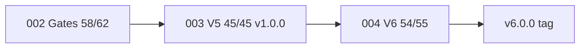

# Feature Specification: IPE Program — Full Phases & Tasks Status

**Feature Branch**: `005-ipe-program-status`

**Created**: 2026-06-23

**Status**: Active — updated 2026-06-23 (`/speckit.specify` full pipeline run)

**Live demo**: ⚠️ 14/20 last run — REL-DEMO in progress (schedule scope + stack rebuild)

**Input**: Consolidated rollup from `002-release-stabilization-gates`, `003-autonomous-planning-v5`, `004-ai-first-v6`, `READINESS.md`, and Notion [IPE Task Tracker v2](https://app.notion.com/p/788f0c170abe4648b482587d41745625).

**Purpose**: Single authoritative view of **every speckit phase and task** — what is done, in progress, blocked, or planned — for executives, PM, and engineering.

---

## Executive Summary

| Metric | Value |
|--------|-------|
| **Program readiness** | **96/100** (004 V6-R1–R5 complete; tag pending) |
| **Speckit tasks total** | **162** (002: 62 · 003: 45 · 004: 55) |
| **Complete** | **157 / 162 (97%)** |
| **Open** | **5** (002 git hygiene: 4 · 004 T055 tag: 1 · REL demo pending) |
| **Release track (REL-*)** | **11/30** — launch-verify ✅; stack + demo open |
| **Current release tag** | `v1.0.0` (`4efb8de`) |
| **Next release target** | `v6.0.0` (004 exit gate — ready to tag) |
| **Active workstream** | **004 T055** — git tag v6.0.0 after demo verify |

### Program Timeline

```text
002 Release Gates ──► 003 V5 Convergence (v1.0.0) ──► 004 V6 AI-First (v6.0.0)
     58/62 ✅              45/45 ✅                      54/55 ✅
```

### Notion Tracking

| Artifact | Status |
|----------|--------|
| [Project hub](https://app.notion.com/p/3886f21f521a8172b5d5f4209bc2b77d) | ✅ Created |
| [Implementation Plan](https://app.notion.com/p/3886f21f521a81ed8716ea487da6193f) | ✅ Created |
| [Status Dashboard](https://app.notion.com/p/3886f21f814f9c10e70a99ae2435) | ✅ Created |
| [IPE Task Tracker v2](https://app.notion.com/p/788f0c170abe4648b482587d41745625) | ✅ T016–T054 synced; T055 + REL tasks open |

---

## Feature 002 — Release Stabilization & Deployment Gates

**Branch**: `002-release-stabilization-gates`  
**Status**: **58/62 complete (94%)** — Gates 1–3 passed; git/tag hygiene open  
**Readiness contribution**: Foundation for demo + CI (85→92 path)

| Phase | Tasks | Done | Status | Exit Gate |
|-------|-------|------|--------|-----------|
| 1 Setup | T001–T005 | 5/5 | ✅ Complete | Evidence dirs + env template |
| 2 Foundational | T006–T009 | 4/4 | ✅ Complete | JWT tests + Makefile |
| 3 US1 Engineering | T010–T024 | 15/15 | ✅ Complete | **Gate 1** signed |
| 4 US2 Operations | T025–T034 | 10/10 | ✅ Complete | **Gate 2** signed |
| 5 US3 Documentation | T035–T042 | 8/8 | ✅ Complete | READINESS.md @ 85 |
| 6 US4 Release gates | T043–T047 | 5/5 | ✅ Complete | **Gate 3** (Product sig pending) |
| 7 US5 Git/release | T048–T054 | 3/7 | ⚠️ Partial | 4 tasks open |
| 8 Polish | T055–T058 | 4/4 | ✅ Complete | Quickstart validated |
| 9 Productization | T059–T062 | 4/4 | ✅ Complete | Login @ :8082 |

### Open Tasks (002)

| Task | Description | Priority |
|------|-------------|----------|
| T049 | Commit test/env fixes | P2 |
| T050 | Commit docs reconciliation | P2 |
| T051 | Commit gate evidence structure | P2 |
| T053 | Tag `v1.0.0-rc1` on Gate 2 SHA | P2 |

**Note**: Superseded in practice by **003 tag `v1.0.0`**; T049–T053 remain hygiene backlog.

---

## Feature 003 — Autonomous Production Planning V5.0

**Branch**: `003-autonomous-planning-v5`  
**Status**: **45/45 complete (100%)** ✅  
**Tag**: `v1.0.0` (`4efb8de`)  
**Readiness**: 92/100 — see [clarify.md](../003-autonomous-planning-v5/clarify.md)

| Phase | Tasks | Done | Status | Exit Gate |
|-------|-------|------|--------|-----------|
| **R1** Close the loop | T001–T017 | 17/17 | ✅ Complete | Approve → CDM → Kafka |
| **R2** Planner UX & LLM | T018–T031 | 14/14 | ✅ Complete | Sliders, XAI, tiered LLM |
| **R3** Enterprise governance | T032–T039 | 8/8 | ✅ Complete | MDR gate, Twin, War Room $ |
| **R4** Production hardening | T040–T045 | 6/6 | ✅ Complete | Chaos/k6/SAP/D365 tooling |

### R1 Task Rollup (all ✅)

| ID | Summary |
|----|---------|
| T001–T002 | Migration 023 + WorkOrder.version |
| T003–T010 | Priority resolver, schedule persistence, approve API, Kafka |
| T011–T013 | Connector consumer, frontend approve flow |
| T014–T017 | Tests + demo checkpoint 16 |

### R2 Task Rollup (all ✅)

| ID | Summary |
|----|---------|
| T018–T019 | Heuristic fallback |
| T020–T023 | Validate endpoint, control panel |
| T024–T025 | XAI explain panel |
| T026–T029 | Ollama + tiered LLM + Admin tier health |
| T030–T031 | Tests |

### R3 Task Rollup (all ✅)

| ID | Summary |
|----|---------|
| T032–T034 | MDR composite 70% + gate |
| T035–T036 | MDR dashboard + Digital Twin panel |
| T037–T039 | Resolution $ columns, routes, War Room aggregate |

### R4 Task Rollup (all ✅)

| ID | Summary |
|----|---------|
| T040 | Chaos scripts (`infrastructure/chaos/`) |
| T041–T042 | SAP/D365 sandbox mappers |
| T043 | Airflow in compose |
| T044 | k6 200 VU script |
| T045 | Tag v1.0.0 + RELEASE_NOTES |

### Residual Caveats (003 clarify C7–C10)

- Live k6 200 VU + Chaos Mesh evidence not attached
- Digital Twin promote/clone deferred
- SAP/D365 live sandbox — mapper-only
- `cdm_schedule_version` table deferred

---

## Feature 004 — IPE V6.0 AI-First Strategic Reassessment

**Branch**: `004-ai-first-v6`  
**Status**: **54/55 complete (98%)** — **V6-R1–R5 ✅**; T055 tag pending  
**Baseline**: 003 @ v1.0.0  
**Target**: v6.0.0 @ ≥96/100 readiness

| Phase | Tasks | Done | Status | Exit Gate |
|-------|-------|------|--------|-----------|
| **V6-R1** Activity-Based Planning | T001–T015 | 15/15 | ✅ Complete | ≥8% activity-cost delta |
| **V6-R2** Tariff & Landed Cost | T016–T028 | 13/13 | ✅ Complete | Tariff shock + substitute draft |
| **V6-R3** Visual CPM | T029–T036 | 8/8 | ✅ Complete | p95 cascade <2s |
| **V6-R4** Predictive Maintenance | T037–T045 | 9/9 | ✅ Complete | Telemetry → block published |
| **V6-R5** Cost of Chaos + War Room | T046–T055 | 9/10 | ✅ Complete | CFO dashboard; T055 tag open |

### V6-R1 Task List (✅ all complete — 2026-06-23)

| ID | Component | Path / deliverable |
|----|-----------|-------------------|
| T001 | Migration 024 | `migrations/versions/024_add_activity_cost_drivers.py` |
| T002 | Model | `ipe_shared/models/activity_cost.py` |
| T003 | Seed | `scripts/seed-demo-client.sql` |
| T004 | Margin priority | `dpe-svc/.../margin_priority.py` |
| T005 | API | `GET /demand/priority/margin-aware` |
| T006 | Wiring | `cap-svc/.../priority_resolver.py` |
| T007 | Solver objective | `cap-svc/.../activity_objective.py` |
| T008 | Schedule API | `strategy=activity_optimized` |
| T009 | Heuristic | `activity_cost_estimate`, `optimality_gap` |
| T010 | Guardrail 85% | `schedule_persistence.py` + connector |
| T011 | Audit | `autonomy_downgraded_to_suggest` |
| T012–T014 | Tests | margin, activity, guardrail |
| T015 | Demo | checkpoint 17 |

### V6-R2 through V6-R5

See [../004-ai-first-v6/tasks.md](../004-ai-first-v6/tasks.md) — **54/55 complete** (T055 tag open).

---

## Cross-Feature Dependency Graph



---

## Readiness Score Progression

| Milestone | Score | Trigger |
|-----------|-------|---------|
| Post-002 Gate 2 | 85/100 | READINESS.md initial |
| Post-003 R1 | 85/100 | Closed-loop schedule |
| Post-003 R2 | 90/100 | Planner UX |
| Post-003 R3 | 95/100 | MDR + War Room |
| Post-003 v1.0.0 (historical) | **92/100** | 003 complete; R4 live evidence pending |
| Post-004 V6-R1 | 93/100 | ABP + guardrail |
| **Current (v6.0.0-ready)** | **96/100** | V6-R1–R5 code complete; T055 tag pending |
| Production 100/100 | 100/100 | k6 + Chaos evidence |

---

## Demo Checkpoint Status

| Checkpoint | Feature | Status |
|------------|---------|--------|
| 1–15 | Pre-003 baseline | ✅ |
| 16 | 003 R1 persist-after-approve | ✅ |
| 17 | 004 V6-R1 margin-aware | ✅ |
| 18 | 004 V6-R2 tariff shock | ✅ |
| 19 | 004 V6-R3 CPM cascade | ✅ |
| 20 | 004 V6-R4/R5 maint + chaos + war room | ✅ |
| **Target** | **20/20** at v6.0.0 | **20/20 implemented** |

---

## Blocked & Out of Scope (program-wide)

| Item | Feature | Status |
|------|---------|--------|
| Keycloak live IdP / SAML / SCIM | 002 C-007 | 🔴 BLOCKED |
| Phoenix commerce (Engine A) | 004 | Out of scope |
| Live SAP/D365 connectors | 003 clarify C9 | Mapper-only |
| Stripe billing, mobile app | 002 READINESS | Out of scope |

---

## Success Criteria (this spec)

| ID | Criterion | Met |
|----|-----------|-----|
| SC-P-01 | All speckit phases listed with task counts | ✅ |
| SC-P-02 | Every open task identifiable by ID + feature | ✅ |
| SC-P-03 | Readiness score tied to phase completion | ✅ |
| SC-P-04 | Notion + repo cross-links documented | ✅ |
| SC-P-05 | Updated within 24h of any phase exit gate | ⬜ process |

---

## Source of Truth Hierarchy

1. **Task completion**: `specs/*/tasks.md` checkboxes (this spec aggregates)
2. **Product requirements**: `specs/*/spec.md` per feature
3. **Release readiness**: `READINESS.md` + `RELEASE_NOTES.md`
4. **Binding decisions**: `specs/*/clarify.md`
5. **External tracker**: Notion IPE Task Tracker v2 (mirror; repo wins on conflict)

---

## Next Commands

| Goal | Command |
|------|---------|
| Tag v6.0.0 | Approve T055 → `git tag -a v6.0.0` |
| Verify demo | `.\scripts\run-full-demo.ps1` (20 checkpoints) |
| Verify tests | `.\scripts\launch-verify.ps1` |
| Production 100/100 | Run k6 200 VU + Chaos evidence |
| Refresh status | `/speckit.specify` after tag |

**Next milestone**: **T055** git tag `v6.0.0` after demo verify passes.
