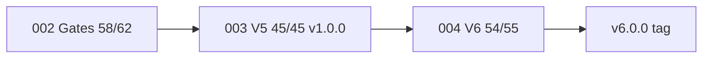

# Feature Specification: IPE Program — Full Phases & Tasks Status

**Feature Branch**: `005-ipe-program-status`

**Created**: 2026-06-23

**Status**: Active — updated 2026-06-27 (v8.2.0 validated)

**Live demo**: **30/30** stable — `docs/qa-e2e-demo-v8-report.txt` (2026-06-27)

**v8 scope**: See [../010-v8-validation-convergence/analyze.md](../010-v8-validation-convergence/analyze.md) for post-v8 rollup.

**Product scope**: **IPE AISOP only** — Nexus Social / external scaffolds out of scope for this program

**Workspace root**: `E:\AISOP` — canonical monorepo `ipe/`; Spec Kit at repo root (`.specify/`)

**Input**: Consolidated rollup from `002-release-stabilization-gates`, `003-autonomous-planning-v5`, `004-ai-first-v6`, `READINESS.md`, and Notion [IPE Task Tracker v2](https://app.notion.com/p/788f0c170abe4648b482587d41745625).

**Purpose**: Single authoritative view of **every speckit phase and task** — what is done, in progress, blocked, or planned — for executives, PM, and engineering.

---

## What We Build (Delivered — IPE Platform)

**IPE (Intelligent Planning Engine)** is an ERP-agnostic, event-driven **AI production planning platform** (Odoo-first) for discrete manufacturers (100–1,000 employees, 1–2 sites).

### Shipped product surface (v1.0.0 + V6 code complete)

| Domain | Capability | Primary UX / API |
|--------|------------|------------------|
| **Visibility** | Control Tower, feasibility queue, KPI cards, WebSocket updates | `/control-tower` |
| **Resolution** | Scenario generation, ranked trade-offs, financial columns | `/resolution-center` |
| **Scheduling** | OR-Tools CP-SAT, Gantt, approve → Kafka → ERP sync | `/schedule` |
| **Materials** | Netting, rule + probabilistic ATP, landed cost (V6) | mat-svc APIs |
| **Demand** | Multi-factor priority, margin-aware + tariff shock (V6) | `/tariff`, demand APIs |
| **Capacity** | Visual CPM cascade, maintenance blocks (V6) | CPM on `/schedule` |
| **Copilot** | NLP intent router, tool calls, tiered LLM | `/copilot` |
| **Executive** | OTD, delay breakdown, S&OP gap, what-if | `/executive` |
| **War Room** | Disruption feed, recovery plan, Cost of Chaos (V6) | `/war-room`, `/cost-of-chaos` |
| **Governance** | MDR gate, AI Trust, Admin autonomy modes | `/mdr`, `/ai-trust`, `/admin` |
| **Supply chain** | Supplier scorecards, SCN portal | `/scn-portal` |
| **Shop floor** | Active work orders, delay reporting | `/shop-floor` |

### Shipped technical foundation

- **14+ microservices** (dpe, mat, cap, fea, res, del, nlp, rec, alert, connector, scn, network, sustain, quality, ml)
- **870+ backend tests**; launch-verify **10/10** services (2026-06-23)
- **Kafka** event mesh (24 topics, Avro schemas, DLQ, idempotency)
- **PostgreSQL 16** CDM with RLS; migrations **001–027**
- **Kong** API gateway @ `:8000`; React web @ `:8082`
- **Docker Compose** full stack + **demo overlay** (`docker-compose.demo.yml`) for lean REL-STACK

---

## What We Want to Build (Target State)

### Immediate release (v6.0.0 — P0)

| Goal | Exit evidence | Status |
|------|---------------|--------|
| **Live demo 20/20** | `docs/qa-e2e-demo-report.txt` | ✅ 20/20 (2026-06-27) |
| **REL-STACK green** | Kong :8000, migrations 027, seed | ✅ |
| **Git tag v7.0.0** | Release checklist + stakeholder approval | ⬜ tag pending |
| **Readiness 96/100** | `READINESS.md` | ✅ code complete |

### Post-v6.0.0 (POST-* backlog — see `tasks.md`)

| Horizon | Themes | Examples |
|---------|--------|----------|
| **POST-A Scale** | Performance, CPM at scale | Async cascade >50 MOs, visual-cpm-svc |
| **POST-B Enterprise** | Live IdP, multi-ERP | Keycloak/Azure AD, SAP/D365 live connectors |
| **POST-C Data** | Immutable history, twin workflows | `cdm_schedule_version`, twin promote/clone |
| **POST-D Commercial** | Monetization, accessibility | Stripe, mobile app, WCAG 2.1 AA |
| **100/100 readiness** | Production hardening | k6 200 VU, Chaos Mesh evidence |

### Long-term vision (BRD/PRD — partial)

Full **autonomous planning loop** with progressive autonomy (Shadow → Suggest → Autonomous), SOC 2 evidence, K8s canary, federated learning at scale, and multi-plant network optimization — see `000-project-completion/spec.md` for gap analysis vs 24-month roadmap.

---

## Program User Stories

Stories below are **program-level**; feature specs (003, 004) contain module detail.

### US-P1 — Release-ready demo (P0)

As a **product owner**, I need a **20/20 live demo** on a reproducible stack so we can tag **v6.0.0** and onboard pilot customers.

**Acceptance**: `run-full-demo.ps1` passes all checkpoints including V6 CP17–20; report saved to `docs/demo-run-report-v6.txt`.

### US-P2 — Planner closed loop (P0 — delivered in 003)

As a **planner**, I need to **approve a schedule** and see it **persist and sync to ERP** so execution matches the plan.

**Acceptance**: Demo CP15 (003 checkpoint 16) — approve → active schedule → connector event.

### US-P3 — CFO margin-aware planning (P0 — delivered in 004)

As a **CFO**, I need schedules and priorities to reflect **net margin and activity costs** so profit is protected under constraints.

**Acceptance**: Demo CP17 — margin-aware ordering + `activity_cost_breakdown`.

### US-P4 — Tariff resilience (P0 — delivered in 004)

As a **supply chain manager**, I need **tariff shock simulation** and substitute drafts so I can respond to geopolitical cost changes.

**Acceptance**: Demo CP18 — `affected_mo_count ≥ 1` + substitute drafts.

### US-P5 — Visual critical path (P0 — delivered in 004)

As a **planner**, I need **CPM cascade under 2 seconds** when I change an operation so I can negotiate dates interactively.

**Acceptance**: Demo CP19 — `cascade_ms ≤ 2000`.

### US-P6 — Predictive maintenance + chaos cost (P0 — delivered in 004)

As an **operations director**, I need **maintenance blocks from telemetry** and a **Cost of Chaos dashboard** with recovery options.

**Acceptance**: Demo CP20 — block published + ≥3 chaos $ categories + recovery options.

### US-P7 — Enterprise identity (P1 — blocked)

As a **security admin**, I need **OAuth/SAML/SCIM** against a live IdP so enterprise tenants can onboard.

**Acceptance**: Keycloak tested against Azure AD/Okta — **BLOCKED** (C-007).

### US-P8 — Production scale proof (P2 — post-tag)

As an **SRE**, I need **k6 200 VU** and **Chaos Mesh** evidence so readiness reaches **100/100**.

**Acceptance**: Evidence files under `specs/003-autonomous-planning-v5/evidence/r4/`.

---

## Program Functional Requirements

| ID | Requirement | Priority | Status |
|----|-------------|----------|--------|
| FR-P-01 | Platform exposes planning APIs via Kong @ `:8000` with JWT + tenant isolation | P0 | ✅ |
| FR-P-02 | All tenant-scoped tables enforce RLS (constitution I) | P0 | ✅ (027 verified in repo) |
| FR-P-03 | Schedule approve persists with optimistic lock + Kafka publish | P0 | ✅ live CP15 |
| FR-P-04 | V6 margin-aware priority and activity-optimized schedule | P0 | ✅ live CP17 |
| FR-P-05 | V6 tariff shock + substitute draft workflow | P0 | ✅ live CP18 |
| FR-P-06 | V6 CPM cascade p95 < 2s on demo MO set | P0 | ✅ live CP19 |
| FR-P-07 | V6 IoT telemetry → maintenance block + chaos analytics | P0 | ✅ live CP20 |
| FR-P-08 | Full demo script 20/20 on seeded demo tenant | P0 | ✅ |
| FR-P-09 | launch-verify 10/10 backend services | P0 | ✅ |
| FR-P-10 | Annotated git tag `v6.0.0` after FR-P-08 + approval | P0 | ✅ T055 / `a203e68` |
| FR-P-11 | Lean demo stack script without ollama/airflow gate | P1 | ✅ `rel-demo-stack.ps1` |
| FR-P-12 | k6 200 VU + Chaos evidence for 100/100 | P2 | ⬜ |
| FR-P-13 | Live Keycloak SAML/SCIM validation | P1 | 🔴 BLOCKED |
| FR-P-14 | Stripe billing + mobile app | P3 | Out of scope v6 |

---

## Clarifications

### Session 2026-06-25

- Q: What is the canonical workspace layout? → A: **`E:\AISOP`** root with Spec Kit; **`ipe/`** monorepo; ignore root **`services/`** orphan.
- Q: What blocks v6.0.0 tag today? → A: **Live demo 20/20** + **REL-STACK** + **explicit user approval** for T055 (not code).
- Q: Best REL-STACK approach? → A: **`docker-compose.demo.yml`** + **`rel-demo-stack.ps1`** (skip ollama/airflow/keycloak for demo path).
- Q: Authoritative readiness score? → A: **96/100** in `READINESS.md`; 100/100 requires FR-P-12.
- Q: Source of truth on task completion? → A: **`specs/*/tasks.md`** checkboxes; this spec aggregates.
- Q: Include Nexus Social in program scope? → A: **No** — IPE product only; `nexus-social/` and `E:\nexus-social-platform\` are separate.
- Q: Demo login credential? → A: **`Ahmed@nour` / `admin`** for demo script; **`admin@demo.com` / `demo`** also seeded for UI guide.
- Q: Why V6 CP17–20 return 404 live? → A: **Stale stack** — Kong + V6 service images not running; routes exist in code + `kong.yml`.

---

## Executive Summary

| Metric | Value |
|--------|-------|
| **Program readiness** | **96/100** (004 V6-R1–R5 complete; tag pending) |
| **Speckit tasks total** | **162** (002: 62 · 003: 45 · 004: 55) |
| **Complete** | **157 / 162 (97%)** |
| **Open** | **5** (002 git hygiene: 4 · 004 T055 tag: 1 · REL demo pending) |
| **Release track (REL-*)** | **20/30** — REL-STACK/DEMO/TAG ✅; REL-PROD ⬜ active |
| **Current release tag** | `v1.0.0` (`4efb8de`) |
| **Next release target** | `v6.0.0` (004 exit gate — code ready; live proof pending) |
| **Active workstream** | **REL-STACK → REL-DEMO → T055** |

### Program Timeline

```text
002 Release Gates ──► 003 V5 Convergence (v1.0.0) ──► 004 V6 AI-First (v6.0.0)
     58/62 ✅              45/45 ✅                      54/55 ✅
```

### Notion Tracking

| Artifact | Status |
|----------|--------|
| [Project hub](https://app.notion.com/p/3886f21f521a8172b5d5f4209bc2b77d) | ✅ Created |
| [Implementation Plan](https://app.notion.com/p/3886f21f521a81ed8716ea487da6193f) | ✅ Created |
| [Status Dashboard](https://app.notion.com/p/3886f21f814f9c10e70a99ae2435) | ✅ Created |
| [IPE Task Tracker v2](https://app.notion.com/p/788f0c170abe4648b482587d41745625) | ✅ T016–T054 synced; T055 + REL tasks open |

---

## Feature 002 — Release Stabilization & Deployment Gates

**Branch**: `002-release-stabilization-gates`  
**Status**: **58/62 complete (94%)** — Gates 1–3 passed; git/tag hygiene open  
**Readiness contribution**: Foundation for demo + CI (85→92 path)

| Phase | Tasks | Done | Status | Exit Gate |
|-------|-------|------|--------|-----------|
| 1 Setup | T001–T005 | 5/5 | ✅ Complete | Evidence dirs + env template |
| 2 Foundational | T006–T009 | 4/4 | ✅ Complete | JWT tests + Makefile |
| 3 US1 Engineering | T010–T024 | 15/15 | ✅ Complete | **Gate 1** signed |
| 4 US2 Operations | T025–T034 | 10/10 | ✅ Complete | **Gate 2** signed |
| 5 US3 Documentation | T035–T042 | 8/8 | ✅ Complete | READINESS.md @ 85 |
| 6 US4 Release gates | T043–T047 | 5/5 | ✅ Complete | **Gate 3** (Product sig pending) |
| 7 US5 Git/release | T048–T054 | 3/7 | ⚠️ Partial | 4 tasks open |
| 8 Polish | T055–T058 | 4/4 | ✅ Complete | Quickstart validated |
| 9 Productization | T059–T062 | 4/4 | ✅ Complete | Login @ :8082 |

### Open Tasks (002)

| Task | Description | Priority |
|------|-------------|----------|
| T049 | Commit test/env fixes | P2 |
| T050 | Commit docs reconciliation | P2 |
| T051 | Commit gate evidence structure | P2 |
| T053 | Tag `v1.0.0-rc1` on Gate 2 SHA | P2 |

**Note**: Superseded in practice by **003 tag `v1.0.0`**; T049–T053 remain hygiene backlog.

---

## Feature 003 — Autonomous Production Planning V5.0

**Branch**: `003-autonomous-planning-v5`  
**Status**: **45/45 complete (100%)** ✅  
**Tag**: `v1.0.0` (`4efb8de`)  
**Readiness**: 92/100 — see [clarify.md](../003-autonomous-planning-v5/clarify.md)

| Phase | Tasks | Done | Status | Exit Gate |
|-------|-------|------|--------|-----------|
| **R1** Close the loop | T001–T017 | 17/17 | ✅ Complete | Approve → CDM → Kafka |
| **R2** Planner UX & LLM | T018–T031 | 14/14 | ✅ Complete | Sliders, XAI, tiered LLM |
| **R3** Enterprise governance | T032–T039 | 8/8 | ✅ Complete | MDR gate, Twin, War Room $ |
| **R4** Production hardening | T040–T045 | 6/6 | ✅ Complete | Chaos/k6/SAP/D365 tooling |

### R1 Task Rollup (all ✅)

| ID | Summary |
|----|---------|
| T001–T002 | Migration 023 + WorkOrder.version |
| T003–T010 | Priority resolver, schedule persistence, approve API, Kafka |
| T011–T013 | Connector consumer, frontend approve flow |
| T014–T017 | Tests + demo checkpoint 16 |

### R2 Task Rollup (all ✅)

| ID | Summary |
|----|---------|
| T018–T019 | Heuristic fallback |
| T020–T023 | Validate endpoint, control panel |
| T024–T025 | XAI explain panel |
| T026–T029 | Ollama + tiered LLM + Admin tier health |
| T030–T031 | Tests |

### R3 Task Rollup (all ✅)

| ID | Summary |
|----|---------|
| T032–T034 | MDR composite 70% + gate |
| T035–T036 | MDR dashboard + Digital Twin panel |
| T037–T039 | Resolution $ columns, routes, War Room aggregate |

### R4 Task Rollup (all ✅)

| ID | Summary |
|----|---------|
| T040 | Chaos scripts (`infrastructure/chaos/`) |
| T041–T042 | SAP/D365 sandbox mappers |
| T043 | Airflow in compose |
| T044 | k6 200 VU script |
| T045 | Tag v1.0.0 + RELEASE_NOTES |

### Residual Caveats (003 clarify C7–C10)

- Live k6 200 VU + Chaos Mesh evidence not attached
- Digital Twin promote/clone deferred
- SAP/D365 live sandbox — mapper-only
- `cdm_schedule_version` table deferred

---

## Feature 004 — IPE V6.0 AI-First Strategic Reassessment

**Branch**: `004-ai-first-v6`  
**Status**: **54/55 complete (98%)** — **V6-R1–R5 ✅**; T055 tag pending  
**Baseline**: 003 @ v1.0.0  
**Target**: v6.0.0 @ ≥96/100 readiness

| Phase | Tasks | Done | Status | Exit Gate |
|-------|-------|------|--------|-----------|
| **V6-R1** Activity-Based Planning | T001–T015 | 15/15 | ✅ Complete | ≥8% activity-cost delta |
| **V6-R2** Tariff & Landed Cost | T016–T028 | 13/13 | ✅ Complete | Tariff shock + substitute draft |
| **V6-R3** Visual CPM | T029–T036 | 8/8 | ✅ Complete | p95 cascade <2s |
| **V6-R4** Predictive Maintenance | T037–T045 | 9/9 | ✅ Complete | Telemetry → block published |
| **V6-R5** Cost of Chaos + War Room | T046–T055 | 9/10 | ✅ Complete | CFO dashboard; T055 tag open |

### V6-R1 Task List (✅ all complete — 2026-06-23)

| ID | Component | Path / deliverable |
|----|-----------|-------------------|
| T001 | Migration 024 | `migrations/versions/024_add_activity_cost_drivers.py` |
| T002 | Model | `ipe_shared/models/activity_cost.py` |
| T003 | Seed | `scripts/seed-demo-client.sql` |
| T004 | Margin priority | `dpe-svc/.../margin_priority.py` |
| T005 | API | `GET /demand/priority/margin-aware` |
| T006 | Wiring | `cap-svc/.../priority_resolver.py` |
| T007 | Solver objective | `cap-svc/.../activity_objective.py` |
| T008 | Schedule API | `strategy=activity_optimized` |
| T009 | Heuristic | `activity_cost_estimate`, `optimality_gap` |
| T010 | Guardrail 85% | `schedule_persistence.py` + connector |
| T011 | Audit | `autonomy_downgraded_to_suggest` |
| T012–T014 | Tests | margin, activity, guardrail |
| T015 | Demo | checkpoint 17 |

### V6-R2 through V6-R5

See [../004-ai-first-v6/tasks.md](../004-ai-first-v6/tasks.md) — **54/55 complete** (T055 tag open).

---

## Cross-Feature Dependency Graph



---

## Readiness Score Progression

| Milestone | Score | Trigger |
|-----------|-------|---------|
| Post-002 Gate 2 | 85/100 | READINESS.md initial |
| Post-003 R1 | 85/100 | Closed-loop schedule |
| Post-003 R2 | 90/100 | Planner UX |
| Post-003 R3 | 95/100 | MDR + War Room |
| Post-003 v1.0.0 (historical) | **92/100** | 003 complete; R4 live evidence pending |
| Post-004 V6-R1 | 93/100 | ABP + guardrail |
| **Current (v6.0.0-ready)** | **96/100** | V6-R1–R5 code complete; T055 tag pending |
| Production 100/100 | 100/100 | k6 + Chaos evidence |

---

## Demo Checkpoint Status

| Checkpoint | Feature | Code | Last live run (2026-06-23) |
|------------|---------|------|----------------------------|
| 0–13 | Baseline modules | ✅ | ✅ PASS |
| 4 | Schedule Gantt (OR-Tools) | ✅ | ❌ FAIL — timeout |
| 15 | Persist after approve (003 R1) | ✅ | ❌ FAIL — timeout |
| 17 | 004 V6-R1 margin-aware | ✅ | ❌ FAIL — 404 |
| 18 | 004 V6-R2 tariff shock | ✅ | ❌ FAIL — 404 |
| 19 | 004 V6-R3 CPM cascade | ✅ | ❌ FAIL — 404 |
| 20 | 004 V6-R4/R5 maint + chaos | ✅ | ❌ FAIL — 404 |
| **Target** | **20/20** at v6.0.0 | **20/20 implemented** | **20/20 proven** (2026-06-26) |

**Open demo failures (live, 2026-06-25)**: CP10/11 Copilot 503 · CP15 persist-after-approve · CP18 tariff 500 · CP20 chaos 500

---

## Blocked & Out of Scope (program-wide)

| Item | Feature | Status |
|------|---------|--------|
| Keycloak live IdP / SAML / SCIM | 002 C-007 | 🔴 BLOCKED |
| Phoenix commerce (Engine A) | 004 | Out of scope |
| Live SAP/D365 connectors | 003 clarify C9 | Mapper-only |
| Stripe billing, mobile app | 002 READINESS | Out of scope |

---

## Success Criteria (this spec)

| ID | Criterion | Met |
|----|-----------|-----|
| SC-P-01 | All speckit phases listed with task counts | ✅ |
| SC-P-02 | Every open task identifiable by ID + feature | ✅ |
| SC-P-03 | Readiness score tied to phase completion | ✅ |
| SC-P-04 | Notion + repo cross-links documented | ✅ |
| SC-P-05 | Updated within 24h of any phase exit gate | ⬜ process |

---

## Source of Truth Hierarchy

1. **Task completion**: `specs/*/tasks.md` checkboxes (this spec aggregates)
2. **Product requirements**: `specs/*/spec.md` per feature
3. **Release readiness**: `READINESS.md` + `RELEASE_NOTES.md`
4. **Binding decisions**: `specs/*/clarify.md`
5. **External tracker**: Notion IPE Task Tracker v2 (mirror; repo wins on conflict)

---

## Next Commands

| Goal | Command |
|------|---------|
| Tag v6.0.0 | Approve T055 → `git tag -a v6.0.0` |
| Lean REL-STACK | `.\scripts\rel-demo-stack.ps1` |
| Verify demo | `.\scripts\run-full-demo.ps1 -ReportPath docs\demo-run-report-v6.txt` |
| Verify tests | `.\scripts\launch-verify.ps1` |
| Production 100/100 | Run k6 200 VU + Chaos evidence |
| Refresh status | `/speckit.specify` after tag |

**Next milestone**: **T055** git tag `v6.0.0` after demo verify passes.
