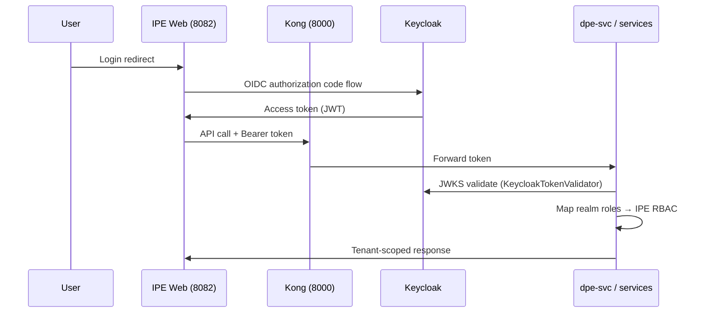

# Keycloak SSO Integration — Analysis (POST-B)

## Architecture

## Migration Plan (local JWT → Keycloak)

1. Deploy Keycloak realm `ipe` with clients `ipe-platform` (confidential) and `ipe-web` (public).
2. Sync users from `cdm_user` to Keycloak (batch job or SCIM).
3. Set `AUTH_PROVIDER=keycloak`, `JWT_USE_JWKS=true`, Keycloak env vars.
4. Run dual-auth window: accept both local and Keycloak tokens (optional bridge).
5. Cut over login UI to Keycloak redirect; retire local password auth.

## Required Keycloak Configuration

| Setting | Value |
|---------|-------|
| Realm | `ipe` |
| Client ID | `ipe-platform` |
| Valid redirect URIs | `http://localhost:8082/*` |
| Realm roles | `ipe-admin`, `ipe-planner`, `ipe-manager`, `ipe-executive` |
| Custom claim | `tenant_id` (mapper from user attribute) |

## Testing Strategy

- Unit: `services/shared/tests/test_auth_keycloak.py` (mocked JWKS)
- Integration: Keycloak Testcontainers + login flow
- E2E: Playwright login via Keycloak redirect

## Scaffold Location

- `services/shared/ipe_shared/auth/keycloak.py`
- `config/keycloak.env.example`
- Feature flag: `AUTH_PROVIDER=local|keycloak`
