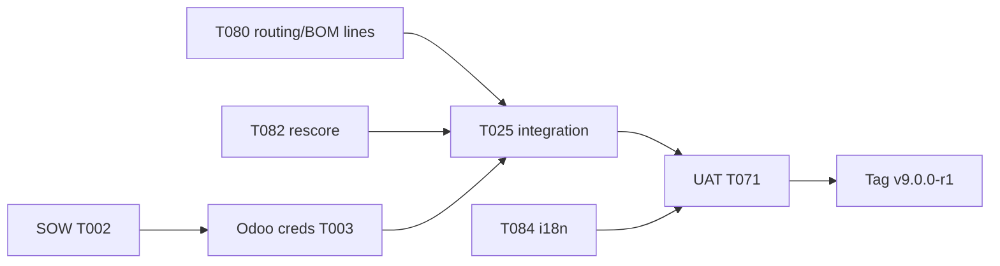

# Plan — 013 Release 1 Odoo + MENA Go-Live

**Feature**: `013-release1-odoo-mena`  
**Version**: 2.2 (post-implement T081)  
**Date**: 2026-06-30  
**Readiness**: 92/100 — engineering complete, UAT blocked on customer  
**Tech stack**: FastAPI, PostgreSQL 16, React/Vite, OR-Tools, Odoo 17/19 XML-RPC  
**Deployment**: Single VM 8 GB — `docker-compose.release1.yml` (9 services incl. web-ui)

---

## 1. Current state vs target

| Milestone | Status |
|-----------|--------|
| Migration 036 + sync tables | ✅ Done |
| Odoo MO/BOM/WC/product/lines/routing/inventory sync | ✅ Done |
| Post-sync feasibility rescore | ✅ Done |
| Data quality flags + sync_run audit | ✅ Done |
| fea-svc queue + unscorable MOs + SYNC_CONFLICT badge | ✅ Done |
| cap-svc direct Odoo activate | ✅ Done |
| release1 compose + web-ui + deploy scripts | ✅ Done |
| Arabic MVP (Control Tower, Resolution, Login, nav) | ✅ Done |
| Admin Odoo config UI + test connection | ✅ Done |
| KMS-encrypted Odoo credentials (T081) | ✅ Done |
| OTD baseline + ROI metrics APIs | ✅ Done |
| Sync failure alert webhook | ✅ Done |
| Playbooks + integration docs | ✅ Done |
| Live Odoo UAT | ⬜ **T071 — blocked on T003** |
| Tag `v9.0.0-r1` | ⬜ **T073** |

---

## 2. Architecture (as deployed)

### 2.1 Release 1 stack

```text
┌─────────────────────────────────────────────────────────────┐
│  Star Trans Odoo 17 (staging → production)                   │
│  + ipe_connector module (write-back receiver)                │
└──────────────────────────┬──────────────────────────────────┘
                           │ XML-RPC every 15 min
                           │ HTTPS activate on schedule approve
┌──────────────────────────▼──────────────────────────────────┐
│  IPE Release 1 — docker-compose.release1.yml                 │
│                                                              │
│  ┌────────┐   ┌─────────┐   ┌─────────┐   ┌──────────┐      │
│  │  Kong  │──►│ dpe-svc │   │ fea-svc │   │ cap-svc  │      │
│  │ :8000  │   │  :8020  │   │  :8021  │   │  :8003   │      │
│  └────────┘   └────┬────┘   └────┬────┘   └────┬─────┘      │
│                    │             │              │            │
│                    └─────────────┴──────┬───────┘            │
│                                         │                    │
│                              ┌──────────▼──────────┐         │
│                              │ connector :8016      │         │
│                              │ sync_engine + sched  │         │
│                              └──────────┬──────────┘         │
│                                         │                    │
│                    ┌────────────────────▼────────────┐       │
│                    │  PostgreSQL 16  +  Redis 7       │       │
│                    │  cdm_sync_run, data_quality_flag │       │
│                    └─────────────────────────────────┘       │
│                                                              │
│  web-ui (host or R1.1 container)                             │
│  VITE_RELEASE_PROFILE=release1 · VITE_DEFAULT_LOCALE=ar      │
└─────────────────────────────────────────────────────────────┘
```

**Services in compose (8):** db, redis, kong, dpe-svc, **fea-svc**, cap-svc, connector  
**Not in compose:** web-ui (host `npm run dev`), nlp-svc, demand/scenario/supply, Keycloak

### 2.2 Data flow — implemented

```text
Odoo mrp.production
    → connector.run_full_sync()
    → upsert cdm_manufacturing_order (+ erp_synced_at)
    → _validate_mo_for_scoring() → cdm_data_quality_flag
    → [DONE] fea-svc rescore after commit
    → GET /feasibility/queue → Control Tower
    → Planner → Resolution (dpe-svc)
    → cap-svc approve schedule
    → erp_direct.activate() → connector → Odoo date_planned_*
```

### 2.3 Data flow — gaps (P0)

```text
All P0 engineering gaps closed 2026-06-24.
Remaining: customer UAT (T071), SOW (T002), staging creds (T003).
```

---

## 3. Tech stack (unchanged)

| Layer | Choice | R1 status |
|-------|--------|-----------|
| API gateway | Kong 3.x | ✅ `kong.release1.yml` |
| Planning / resolution | dpe-svc :8020 | ✅ |
| Feasibility scoring | fea-svc :8021 | ✅ in compose |
| Scheduling | cap-svc :8003 | ✅ `ERP_SYNC_MODE=direct` |
| ERP connector | connector :8016 | 🟡 routing gap |
| Odoo client | XML-RPC via `odoo_client.py` | ✅ |
| Odoo module | `ipe_connector` | ✅ install guide |
| Database | PostgreSQL 16 + Alembic | ✅ migration 036 |
| Cache / lock | Redis 7 | ✅ sync lock optional |
| Frontend | React 18 + Vite + react-i18next | 🟡 Resolution/Login |
| Scheduler | APScheduler 15 min | ✅ `IPE_RELEASE_PROFILE=release1` |
| Events | None | ✅ by design |
| Auth | JWT tenant-scoped | ✅ Keycloak deferred R2 |
| Tests | pytest + Vitest | 🟡 no live Odoo yet |

---

## 4. Database (migration 036 — applied)

Tables and columns implemented per spec §3 in prior plan. Models:

- `services/shared/app/models/sync_run.py`
- `services/shared/app/models/data_quality_flag.py`
- MO extensions: `erp_last_update`, `erp_synced_at`, `sync_conflict`

RLS policies tested in `tests/integration/test_r1_sync_tables_rls.py`.

---

## 5. Connector — implemented + remaining

### 5.1 Implemented (`services/connector/`)

| Component | Path |
|-----------|------|
| Mappers | `app/core/mapper.py` — MO, BOM header, WC, product |
| Sync engine | `app/odoo/sync_engine.py` — upsert, validation, conflicts |
| APIs | `app/api/v1/sync.py` — run, status, data-quality |
| Scheduler | `app/jobs/sync_scheduler.py` |
| Tests | `tests/test_odoo_mapper.py`, `test_odoo_sync_mo.py` |

### 5.2 Remaining — Phase G (pre-UAT)

| Task | Implementation |
|------|----------------|
| **T080** BOM lines | `sync_bom_lines()` — iterate `bom_line_ids`, upsert `cdm_bom_line` |
| **T080** Routing | `sync_routing_operations()` — from BOM `operation_ids` or `mrp.routing.workcenter` |
| **T082** Rescore | After `run_full_sync()` success, HTTP POST to fea-svc with `mo_ids` touched |
| **T081** Vault creds | R1.1 — replace plaintext JSONB password |

Odoo → CDM routing mapping (T080 design):

| Odoo | CDM |
|------|-----|
| `mrp.routing.workcenter.sequence` | `operation_sequence` |
| `mrp.routing.workcenter.workcenter_id` | `work_center_id` (FK) |
| `mrp.routing.workcenter.time_cycle` | `standard_time_minutes` |
| BOM `operation_ids` link | `bom_id` + `mo_id` association |

---

## 6. Frontend — implemented + remaining

### 6.1 Implemented (`apps/web/`)

| Asset | Path |
|-------|------|
| i18n core | `src/lib/i18n.ts`, `locales/en.json`, `locales/ar.json` |
| Release profile | `src/lib/releaseProfile.ts` |
| Language switcher | `src/components/LanguageSwitcher.tsx` |
| Sync bar | `src/components/SyncStatusBar.tsx` |
| Control Tower DQ badges | `ControlTowerPage` release1 branch |
| Tests | `tests/lib/i18n.test.ts` |

### 6.2 Remaining

| Task | Scope |
|------|-------|
| **T084** | Wire `ResolutionCenterPage`, `LoginPage` to `t()` — replace hardcoded strings |
| **T049** | Admin panel: Odoo URL/db/user/password + test connection |
| **T083** | Add `web-ui` nginx service to compose (R1.1) |

Run locally for QA:

```powershell
cd apps\web
$env:VITE_RELEASE_PROFILE = "release1"
$env:VITE_DEFAULT_LOCALE = "ar"
npm run dev
```

---

## 7. Operations (complete)

| Deliverable | Path | Status |
|-------------|------|--------|
| release1 compose | `infrastructure/docker/docker-compose.release1.yml` | ✅ |
| Kong routes | `infrastructure/kong/kong.release1.yml` | ✅ |
| Deploy | `scripts/deploy-release1.ps1` | ✅ |
| Smoke | `scripts/release1-smoke.ps1` | ✅ |
| ROI export | `scripts/export-roi-metrics.ps1` | ✅ |
| Implementation playbook | `docs/implementation/R1-IMPLEMENTATION-PLAYBOOK.md` | ✅ |
| Support runbook | `docs/runbooks/R1-SUPPORT-RUNBOOK.md` | ✅ |
| Odoo install | `docs/integration/ODOO-CONNECTOR-INSTALL.md` | ✅ |
| Field mapping template | `docs/integration/ODOO-FIELD-MAPPING-WORKSHEET.md` | ✅ |

---

## 8. Testing strategy — updated

| Layer | Status | Task |
|-------|--------|------|
| Mapper unit (10 tests) | ✅ | T018 |
| Sync unit (mocked) | ✅ | T019 |
| Sync model + RLS | ✅ | T010–T011 |
| Integration MO → queue | ✅ | T025–T026 |
| Live Odoo staging | ⬜ | T003 + T071 |
| release1-smoke.ps1 | ✅ script | Run on every R1 PR → T036 |
| Windows 8GB VM | ⬜ | T037 |
| Arabic QA native speaker | ⬜ | Pre-T071 |

---

## 9. Phased delivery — revised timeline

### Phases A–E (weeks 1–8) — ✅ COMPLETE

Connector, data quality, compose, Arabic MVP, docs.

### Phase G — Pre-UAT engineering (1–2 weeks) — **IN PROGRESS**

| Week | Deliverable |
|------|-------------|
| G1 | T080 routing + BOM lines + tests |
| G1 | T082 post-sync rescore |
| G1 | T084 Resolution + Login i18n |
| G2 | T025–T026 integration tests with Odoo mock container |

### Phase F — Customer go-live (2–4 weeks) — **BLOCKED on T003**

| Step | Owner |
|------|-------|
| T002 Sign SOW | Commercial |
| T003 Staging creds + install ipe_connector | Star Trans IT |
| Field mapping workshop | Eng + customer |
| Configure tenant `config` (odoo_url, db, creds) | Eng |
| `deploy-release1.ps1` on staging | Eng |
| Live sync → validate SC-R1-04, SC-R1-05 | Eng + planner |
| T071 UAT sign-off | Customer |
| T073 tag `v9.0.0-r1` | Eng |

### Phase H — R1.1 hardening (post-UAT, optional before prod invoice)

T049 Admin UI · T081 vault · T036 CI · T037 VM · sync failure alerts · FR-R1-05 stock sync · FR-R1-16 OTD baseline API

---

## 10. Out of scope (enforce in PR review)

- v8.3 platform features (Copilot, supply network, scenarios)
- New microservices beyond release1 compose
- Kafka in R1
- SAP B1 / D365 connectors
- Changes to 012 Star Trans SQL overlay
- 22-service production K8s

---

## 11. Success gate (unchanged)

```powershell
# Pre-UAT engineering gate:
cd E:\AISOP\ipe
.\scripts\deploy-release1.ps1
.\scripts\release1-smoke.ps1
# T080, T082, T084 merged

# Customer UAT gate:
.\scripts\release1-smoke.ps1 -OdooStaging
# SC-R1-04 ≥95% sync success over 7 days
# SC-R1-05 ≥80% MOs scorable
# Arabic checklist PASS
# T071 signed → git tag v9.0.0-r1
```

---

## 12. Critical path diagram



---

*Generated by `/speckit.plan` v2.0 — 2026-06-29.*
