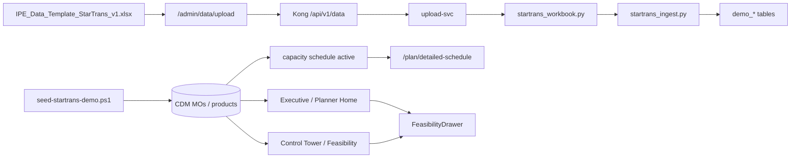

# Technical Plan — Spec 040 Star Trans Demo Aug 18

**Branch:** `033-phase9-wave9a`  
**Stack (chosen — existing IPE R2):**

| Layer | Choice |
|-------|--------|
| Frontend | React 18 + Vite + React Router + Tailwind + SWR |
| Gantt | `frappe-gantt` (MIT) |
| Backend upload | FastAPI `upload-svc` + openpyxl |
| Gateway | Kong R2 (`/api/v1/upload`, `/api/v1/data`) |
| Data | Postgres (`demo_*` simplified) + existing CDM for CT/seed |
| Seed | PowerShell `seed-startrans-demo.ps1` + SQL overlay |

---

## Architecture (demo path)

---

## Workstreams (mapped to STREAM commits)

| WS | Scope | Primary paths |
|----|-------|----------------|
| Hygiene | Greeting, Widget purge, DateCell, Needs data, Copilot tile | `workspace.py`, `HeroBar`, CT page, seeds |
| Excel | Parser, API, ingest, UI, template alignment | `upload-svc/app/core/startrans_*`, `StarTransDataUploadPage` |
| IA / tokens | Nav, breadcrumbs, badges | `productArchitecture.ts`, `tokens.css`, `components/planning/*` |
| Homes | Role switcher + Exec/Planner | `demoRole.ts`, `ExecutiveHome`, `PlannerHome` |
| Schedule | Adapter + FrappeGantt + DetailedSchedulePage | `features/schedule/*` |
| Drawer | Context provider + CT wire | `FeasibilityDrawer*`, `MainLayout` |
| Ops | Walkthrough, hygiene doc, screenshots | `docs/STAR-TRANS-*` |

## Implementation principles

1. Prefer reuse of CT/feasibility APIs over new backends for Homes/Gantt.
2. Never break routes — add aliases + redirects.
3. Demo CDM is explicitly non-production (document in UI/docs).
4. One commit per STREAM task message convention.
5. Constitution: no COM auto-close; tests for parser unit; UI smoke preferred over e2e hang.

## Risks & mitigations

| Risk | Mitigation |
|------|------------|
| Empty schedule | Placeholder + run Auto Schedule / project plan |
| Kong without `/data` | Reload compose after `kong.release2.yml` change |
| Customer late | Seed + template samples |
| Dirty branch noise | Only STAGE Spec 040 / STREAM files for demo PRs |

## Test plan

- Unit: `test_startrans_workbook.py` (24 sheets, reject non-xlsx)
- Manual: walkthrough 8 steps on `:8082`
- Hygiene grep: Widget / UUID / 1970 display
- Optional: Playwright smoke for `/home` role switch (if time)

## Stop conditions

- Sun 17 Aug 18:00 — bugfix only  
- Mon 18 morning — demo mode, no Cursor feature work  
